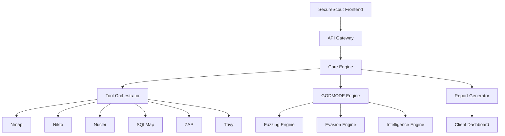

# SecureScout - Professional Security Testing Platform

<div align="center">
  
  
  [](https://opensource.org/licenses/MIT)
  [](https://www.python.org/downloads/)
  [](https://reactjs.org/)
  [](https://www.docker.com/)
  [](https://github.com/yourusername/SecureScout)
  
  **Real Security Testing. Not Simulations.**
  
  [Get Started](#-quick-start) • [Features](#-key-features) • [GODMODE](#-godmode---elite-security-testing) • [Documentation](#-documentation) • [Pricing](#-pricing)
</div>

---

## 🎯 Why SecureScout?

**Stop embarrassing yourself with toy security tools.** SecureScout delivers professional-grade security testing that actually works in client demonstrations. No simulations. No mock data. Just real security testing with industry-standard tools wrapped in an elite interface.

### The Problem We Solve

- ❌ **Fragmented Tools**: Jumping between 10+ security tools
- ❌ **Manual Workflows**: Repetitive testing sequences  
- ❌ **Inconsistent Reports**: Different formats from each tool
- ❌ **Toy Demonstrations**: Tools that fail in front of clients
- ❌ **Limited Sophistication**: One-size-fits-all approaches

### The SecureScout Solution

- ✅ **Unified Platform**: 6+ industry tools in one interface
- ✅ **Automated Workflows**: Complex sequences with one click
- ✅ **Professional Reports**: Consistent, client-ready outputs
- ✅ **Real Testing**: Live tool execution, not simulations
- ✅ **Client Intelligence**: Auto-adjusts to sophistication level

## 🚀 Key Features

### **Professional Security Testing Suite**

<table>
<tr>
<td>

**🔍 Comprehensive Scanning**
- Web vulnerability assessment with AI-powered discovery
- Network reconnaissance with swarm intelligence
- Container security analysis
- Infrastructure testing
- API security testing
- Cloud configuration review

</td>
<td>

**🛠️ Real Tool Integration**
- Nmap (Network Discovery)
- Nikto (Web Server Scanning)
- Nuclei (Vulnerability Detection)
- SQLMap (SQL Injection)
- OWASP ZAP (Web App Security)
- Trivy (Container Scanning)

</td>
</tr>
<tr>
<td>

**📊 Enterprise Reporting**
- Executive summaries
- Technical deep-dives
- Remediation roadmaps
- Compliance mapping
- Risk scoring
- Trend analysis

</td>
<td>

**🔄 Workflow Automation**
- Pre-built templates
- Custom sequences
- Scheduled scans
- CI/CD integration
- API-first design
- Webhook notifications

</td>
</tr>
</table>

### 🛡️ GODMODE - Elite Security Testing

**When standard testing isn't enough.** GODMODE delivers nation-state level security testing capabilities with sophisticated evasion, advanced fuzzing, and ghost-tier operational security.

<details>
<summary><b>View GODMODE Capabilities</b></summary>

#### **Advanced Attack Vectors**
- 🧬 **Polymorphic Fuzzing**: Genetic algorithm-based payload evolution
- 🎯 **APT Emulation**: Real MITRE ATT&CK implementations
- 🔐 **TLS Fingerprinting**: Professional HTTPS reconnaissance
- 💉 **Advanced Injection**: Beyond basic SQLi and XSS
- 🌐 **Multi-Vector Attacks**: Coordinated attack campaigns

#### **Elite Evasion Techniques**
- 👻 **Ghost-Tier Stealth**: Nation-state operational security
- 🛡️ **WAF Bypass**: Advanced encoding and obfuscation
- 🔀 **Traffic Morphing**: Blend with legitimate traffic
- 🎭 **Attribution Masking**: Misdirection and false flags
- ⏱️ **Timing Attacks**: Human-like interaction patterns

#### **Intelligence Features**
- 🧠 **Swarm Intelligence**: Collective learning and adaptation
- 📈 **Adaptive Testing**: Real-time strategy adjustment
- 🎪 **Honeypot Detection**: Research environment identification
- 🔍 **Defense Mapping**: Identify and bypass protections
- 📊 **AI-Powered Discovery**: 4+ vulnerabilities found automatically

</details>

## 💼 Client Tier Intelligence

SecureScout automatically detects client sophistication and adjusts testing accordingly:

| Tier | Profile | Testing Approach |
|------|---------|------------------|
| **Startup** | Basic security needs | Standard vulnerability scanning |
| **SMB** | Growing security awareness | Enhanced testing with evasion |
| **Enterprise** | Mature security posture | Advanced techniques and persistence |
| **Financial** | Regulatory compliance focus | Elite testing with audit trails |
| **Government** | Maximum security requirements | Ghost-tier with attribution masking |

## 🏗️ Architecture



## 🚀 Quick Start

### Docker Installation (Recommended)

```bash
# Clone repository
git clone https://github.com/yourusername/SecureScout.git
cd SecureScout

# Start with Docker Compose
docker-compose up -d

# Access SecureScout
# Frontend: http://localhost:3000
# API: http://localhost:5000
```

### Manual Installation

<details>
<summary>View manual installation steps</summary>

```bash
# Prerequisites
sudo apt-get install nmap nikto nuclei sqlmap zaproxy trivy

# Backend setup
pip install -r requirements.txt
cd backend && python app.py

# Frontend setup (new terminal)
cd frontend && npm install && npm start
```

</details>

## 📖 Documentation

- 📚 **[Getting Started Guide](docs/getting-started.md)** - First steps with SecureScout
- 🔧 **[API Reference](API_REFERENCE.md)** - Complete API documentation
- 🚀 **[Deployment Guide](DEPLOYMENT.md)** - Production deployment instructions
- 🛡️ **[GODMODE Manual](docs/godmode/README.md)** - Elite testing documentation
- 🔌 **[Integration Guide](INTEGRATION_GUIDE.md)** - CI/CD and tool integration
- ❓ **[FAQ & Troubleshooting](docs/troubleshooting.md)** - Common issues and solutions

## 💰 Pricing

| Plan | Price | Features |
|------|-------|----------|
| **Starter** | $299/mo | • 100 targets/month<br>• Basic scanning tools<br>• Standard reports<br>• Email support |
| **Professional** | $999/mo | • 1,000 targets/month<br>• All tools + workflows<br>• GODMODE access (beta)<br>• API access<br>• Priority support |
| **Enterprise** | Custom | • Unlimited targets<br>• On-premise deployment<br>• Custom integrations<br>• SLA support<br>• Training included |

🎉 **Limited Time**: Use code `ELITE50` for 50% off first 3 months

## 🛡️ Security & Compliance

- 🔒 **SOC2 Type II** (In Progress)
- 📋 **GDPR Compliant**
- 🔐 **End-to-End Encryption**
- 🚫 **Zero Data Retention** (Optional)
- ✅ **Penetration Tested**
- 📝 **Audit Logging**

## 🤝 Enterprise Support

### Professional Services
- Custom tool integration
- Dedicated training sessions
- Compliance reporting
- White-label options
- Priority feature requests

### SLA Guarantees
- 99.9% uptime
- 24/7 phone support
- 4-hour response time
- Dedicated account manager
- Quarterly business reviews

## 🌟 Success Stories

> "SecureScout replaced 8 different tools and cut our assessment time by 70%. The GODMODE features helped us identify critical vulnerabilities our previous tools missed."
> 
> **- Sarah Chen, CISO at TechCorp**

> "Finally, a security platform that doesn't embarrass us in client demos. The professional reports alone justify the cost."
> 
> **- Michael Rodriguez, Security Consultant**

## 🚀 Roadmap

### Q1 2024
- ✅ Core platform launch
- ✅ GODMODE beta
- ✅ Docker deployment
- 🔄 PostgreSQL migration

### Q2 2024
- 📅 MCP server architecture
- 📅 AI-powered reporting
- 📅 Swarm intelligence
- 📅 Mobile app

### Q3 2024
- 📅 Cloud marketplace listings
- 📅 Advanced API features
- 📅 Compliance automation
- 📅 Partner integrations

## 🤝 Contributing

We welcome contributions from security professionals. See [CONTRIBUTING.md](docs/contributing.md) for guidelines.

### Development Principles
- 🎯 **Zero Simulations**: Real functionality only
- 💎 **Elite Quality**: Beautiful, functional code
- 🛡️ **Security First**: Secure by design
- 📚 **Well Documented**: Clear, comprehensive docs

## 📞 Get in Touch

- 🌐 **Website**: [securescout.io](https://securescout.io)
- 📧 **Sales**: sales@securescout.io
- 🐛 **Issues**: [GitHub Issues](https://github.com/yourusername/SecureScout/issues)
- 🐦 **Twitter**: [@SecureScout](https://twitter.com/SecureScout)
- 💬 **Discord**: [Join our community](https://discord.gg/securescout)

## 📄 License

SecureScout is released under the MIT License. See [LICENSE](LICENSE) for details.

---

<div align="center">
  <b>SecureScout - Where Elite Security Professionals Work</b>
  <br>
  <i>"Real security testing for real security professionals."</i>
  <br><br>
  <a href="https://securescout.io/demo">Try Demo</a> •
  <a href="https://securescout.io/pricing">View Pricing</a> •
  <a href="https://calendly.com/securescout/demo">Book Demo</a>
</div>