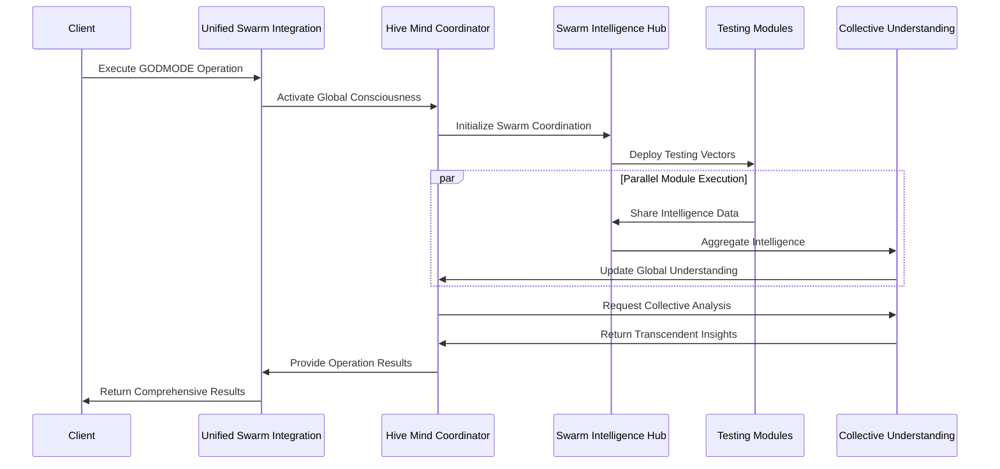
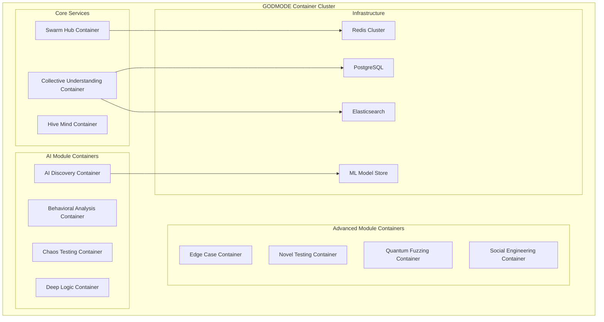
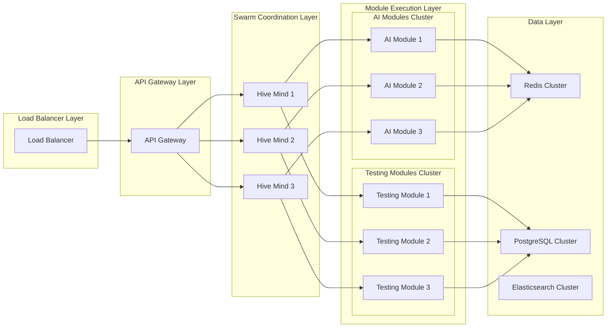
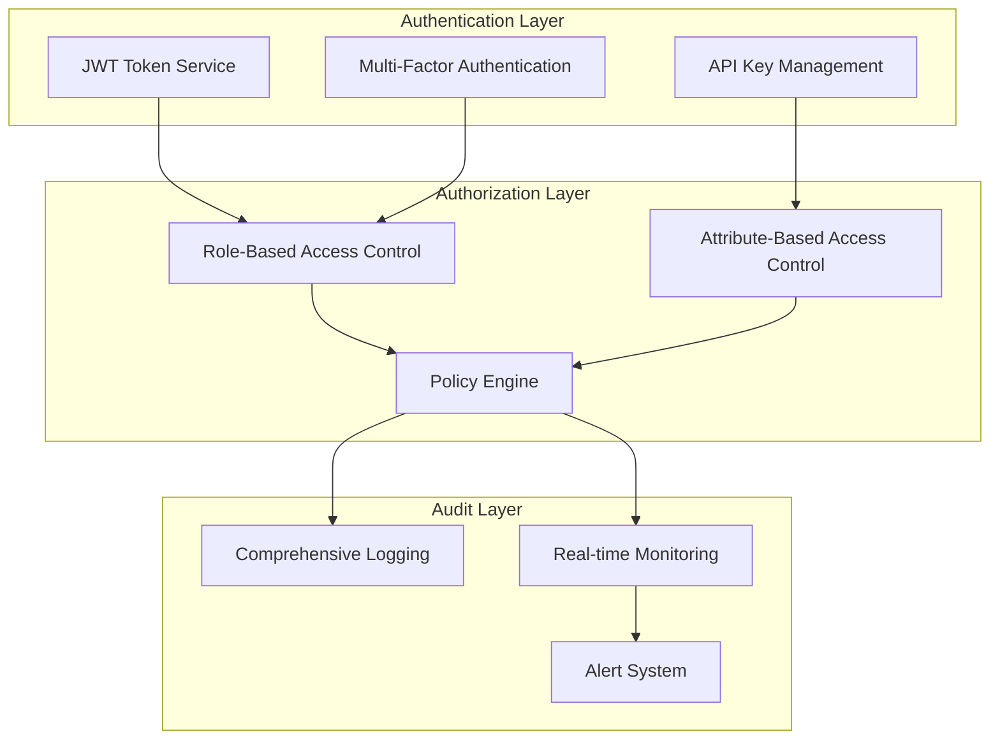
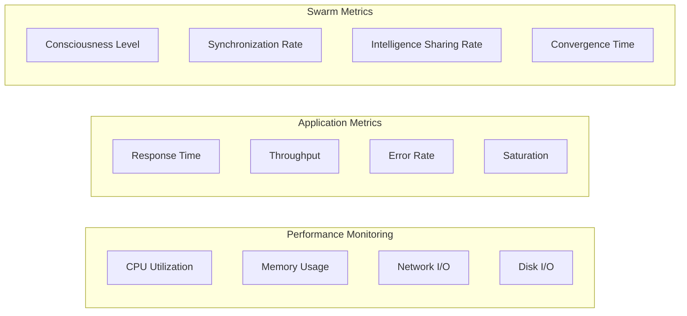
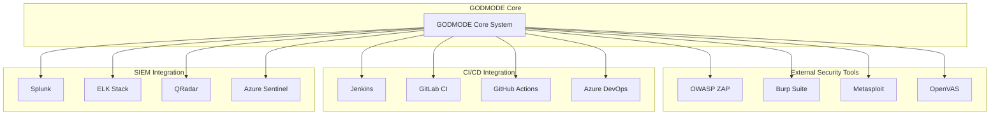
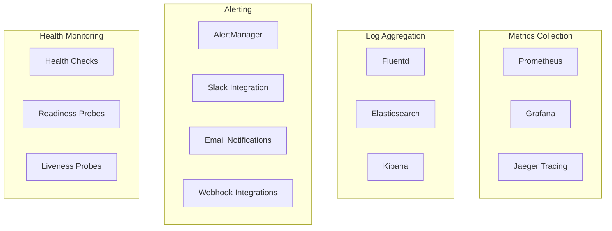
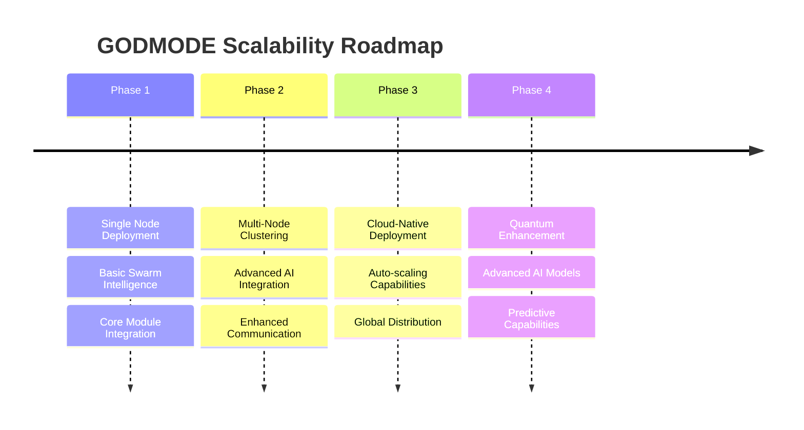

# GODMODE Architecture Documentation

## Overview

The GODMODE (God-tier Omniscient Detection, Monitoring, Operations, Distributed, and Elite) system represents a revolutionary approach to security testing through swarm intelligence and advanced AI capabilities. This document provides a comprehensive technical overview of the system architecture.

## System Architecture

### High-Level Architecture

```mermaid
graph TB
    subgraph "GODMODE Swarm Intelligence System"
        HM[Hive Mind Coordinator]
        SIH[Swarm Intelligence Hub]
        VCP[Vector Communication Protocol]
        CTU[Collective Target Understanding]
    end
    
    subgraph "AI-Powered Modules"
        AID[AI Discovery]
        BA[Behavioral Analysis]
        CT[Chaos Testing]
        DLD[Deep Logic Detection]
    end
    
    subgraph "Advanced Testing Modules"
        ECE[Edge Case Exploitation]
        NTT[Novel Testing Techniques]
        QF[Quantum Fuzzing]
        SEV[Social Engineering Vectors]
    end
    
    subgraph "Integration Layer"
        USI[Unified Swarm Integration]
        ITF[Integration Testing Framework]
    end
    
    subgraph "Traditional Tools"
        ZAP[OWASP ZAP]
        SQL[SQLMap]
        NUC[Nuclei]
        NMAP[Nmap]
    end
    
    HM --> SIH
    SIH --> VCP
    VCP --> CTU
    
    SIH --> AID
    SIH --> BA
    SIH --> CT
    SIH --> DLD
    SIH --> ECE
    SIH --> NTT
    SIH --> QF
    SIH --> SEV
    
    USI --> SIH
    USI --> Traditional Tools
    
    ITF --> USI
```

### Core Components

#### 1. Swarm Intelligence Core

**Hive Mind Coordinator**
- Supreme intelligence orchestrator with transcendent decision-making capabilities
- Manages global consciousness levels and strategic coordination
- Implements consciousness evolution algorithms
- Handles global campaign orchestration

**Swarm Intelligence Hub**
- Central coordination system for all testing vectors
- Manages vector lifecycle and intelligence sharing
- Implements collective learning algorithms
- Coordinates real-time intelligence aggregation

**Vector Communication Protocol**
- Secure inter-module communication with encryption
- Real-time message routing and delivery
- Steganographic communication channels
- Quantum-inspired communication features

**Collective Target Understanding**
- Unified intelligence aggregation from all modules
- Comprehensive target profiling and analysis
- Dynamic vulnerability landscape modeling
- Collective knowledge synthesis

#### 2. AI-Powered Testing Modules

**AI Vulnerability Discovery**
- Machine learning-based vulnerability detection
- Multiple AI models working in concert
- Pattern recognition and anomaly detection
- Neural fuzzing and zero-day prediction

**Behavioral Pattern Analysis**
- Deep behavioral profiling and pattern recognition
- Timing analysis and state machine modeling
- User and system behavior analysis
- Anomaly detection for behavioral vulnerabilities

**Chaos Security Testing**
- Chaos engineering for security vulnerability discovery
- System resilience and failure mode testing
- Cascading failure scenario analysis
- Recovery and fault tolerance testing

**Deep Logic Flaw Detection**
- Business logic vulnerability detection
- Workflow and state machine analysis
- Race condition and TOCTOU detection
- Complex multi-step logic flaw discovery

#### 3. Advanced Testing Techniques

**Edge Case Exploitation**
- Boundary condition and overflow testing
- Unicode and encoding edge cases
- Numeric precision vulnerabilities
- Format string and memory corruption testing

**Novel Testing Techniques**
- Quantum-inspired testing methodologies
- Genetic algorithm-based fuzzing
- Neural network testing approaches
- Consciousness simulation techniques

**Quantum-Inspired Fuzzing**
- Quantum superposition payload generation
- Entangled payload pair creation
- Quantum interference pattern exploitation
- Decoherence analysis for timing vulnerabilities

**Social Engineering Vectors**
- Ethical human factor security testing
- Psychological profiling and social graph analysis
- Phishing and pretexting simulation
- Comprehensive ethical safeguards

### Data Flow Architecture



## Module Specifications

### Core Module Interface

All GODMODE modules implement the following interface:

```python
class GODMODEModule:
    """Base interface for all GODMODE modules"""
    
    async def initialize(self) -> Dict[str, Any]:
        """Initialize module and return status"""
        pass
    
    async def execute_testing(self, target_url: str, config: Dict[str, Any]) -> Dict[str, Any]:
        """Execute module-specific testing"""
        pass
    
    async def share_intelligence(self, intelligence_data: Dict[str, Any]) -> None:
        """Share intelligence with swarm hub"""
        pass
    
    async def receive_intelligence(self, intelligence_data: Dict[str, Any]) -> None:
        """Receive intelligence from other modules"""
        pass
    
    async def get_status(self) -> Dict[str, Any]:
        """Return current module status"""
        pass
```

### Swarm Communication Protocol

```python
@dataclass
class SwarmMessage:
    message_id: str
    source_module: str
    target_modules: List[str]
    message_type: MessageType
    payload: Dict[str, Any]
    timestamp: datetime
    encryption_level: EncryptionLevel
    priority: Priority
```

### Intelligence Data Format

```python
@dataclass
class IntelligenceData:
    intelligence_id: str
    source_module: str
    intelligence_type: IntelligenceType
    confidence_score: float
    findings: List[Finding]
    metadata: Dict[str, Any]
    timestamp: datetime
    sharing_scope: SharingScope
```

## Deployment Architecture

### Container Architecture



### Scalability Architecture



## Security Architecture

### Authentication and Authorization



### Data Protection

- **Encryption**: AES-256 encryption for data at rest and in transit
- **Key Management**: Hardware Security Module (HSM) integration
- **Data Classification**: Automatic data classification and handling
- **Privacy Protection**: PII detection and anonymization
- **Secure Communication**: mTLS for all inter-service communication

## Performance Architecture

### Optimization Strategies

1. **Parallel Execution**: All modules execute in parallel where possible
2. **Intelligent Caching**: Redis-based caching of intelligence data
3. **Resource Management**: Dynamic resource allocation based on workload
4. **Connection Pooling**: Efficient database and service connections
5. **Async Processing**: Fully asynchronous architecture for scalability

### Performance Metrics



## Integration Patterns

### External System Integration



## Monitoring and Observability

### Comprehensive Monitoring Stack



### Key Performance Indicators (KPIs)

1. **System KPIs**
   - Uptime and availability
   - Response time percentiles
   - Error rates and types
   - Resource utilization

2. **Swarm Intelligence KPIs**
   - Swarm consciousness level
   - Intelligence sharing efficiency
   - Collective analysis accuracy
   - Module coordination effectiveness

3. **Security Testing KPIs**
   - Vulnerability discovery rate
   - False positive rate
   - Coverage metrics
   - Time to detection

## Future Architecture Considerations

### Planned Enhancements

1. **Quantum Computing Integration**: Native quantum algorithm support
2. **Advanced AI Models**: Integration of latest AI/ML models
3. **Distributed Swarm**: Multi-datacenter swarm deployment
4. **Real-time Adaptation**: Dynamic module reconfiguration
5. **Predictive Analytics**: Proactive vulnerability prediction

### Scalability Roadmap



This architecture provides a robust, scalable, and secure foundation for the GODMODE system while maintaining flexibility for future enhancements and integrations.