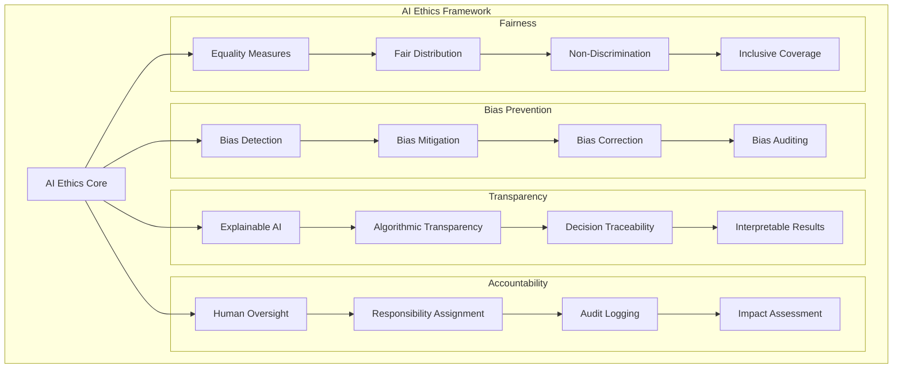
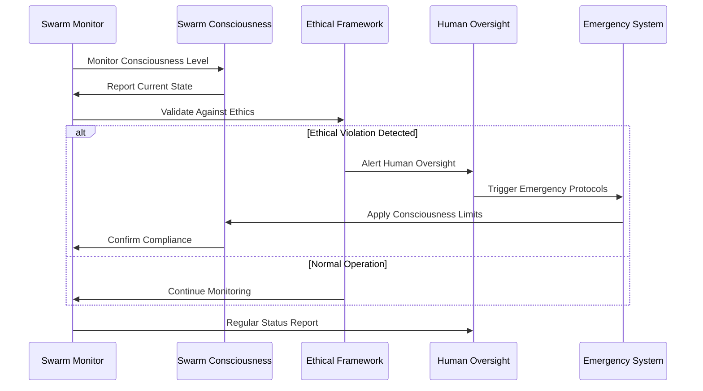
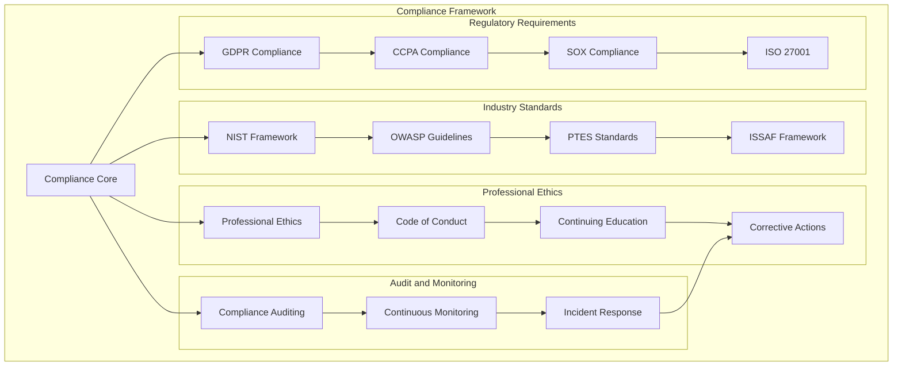
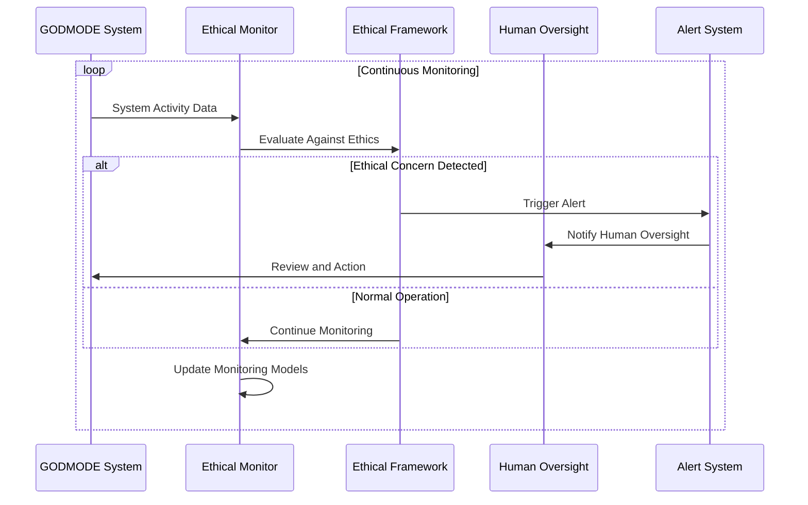

# GODMODE Ethical Guidelines

## Overview

The GODMODE system includes advanced AI and swarm intelligence capabilities that require comprehensive ethical frameworks to ensure responsible use. This document establishes the ethical principles, guidelines, and enforcement mechanisms for all GODMODE operations.

## Core Ethical Principles

### 1. Beneficence (Do Good)
- **Positive Impact**: All GODMODE activities must contribute to improved security
- **Knowledge Advancement**: Share discoveries to advance cybersecurity knowledge
- **Skill Development**: Use capabilities to enhance security professional skills
- **Harm Prevention**: Actively work to prevent security vulnerabilities

### 2. Non-Maleficence (Do No Harm)
- **No Damage**: Never cause damage to systems, data, or individuals
- **Privacy Protection**: Respect and protect individual and organizational privacy
- **No Disruption**: Avoid disrupting normal business operations
- **Psychological Safety**: Ensure no psychological harm to individuals

### 3. Autonomy (Respect Rights)
- **Informed Consent**: Obtain explicit informed consent for all testing
- **Right to Withdraw**: Respect the right to withdraw from testing at any time
- **Self-Determination**: Support individual and organizational autonomy
- **Transparency**: Provide clear information about testing activities

### 4. Justice (Fair Treatment)
- **Equal Treatment**: Apply ethical standards consistently across all contexts
- **Fair Distribution**: Ensure benefits and risks are fairly distributed
- **Non-Discrimination**: Avoid discrimination in testing and analysis
- **Accessibility**: Make security improvements accessible to all

## AI Ethics Framework

### Machine Learning Ethics



### AI Transparency Requirements

```python
class AITransparencyFramework:
    """Framework for AI transparency in GODMODE modules"""
    
    def __init__(self):
        self.explainability_engine = ExplainabilityEngine()
        self.decision_tracker = DecisionTracker()
        self.audit_logger = AuditLogger()
    
    async def explain_ai_decision(self, decision_id: str, context: Dict[str, Any]) -> Dict[str, Any]:
        """Provide explanation for AI decision"""
        explanation = {
            'decision_id': decision_id,
            'algorithm_used': context.get('algorithm'),
            'input_features': context.get('features'),
            'feature_importance': await self._calculate_feature_importance(context),
            'confidence_score': context.get('confidence'),
            'alternative_decisions': await self._generate_alternatives(context),
            'explanation_text': await self._generate_human_explanation(context)
        }
        
        await self.audit_logger.log_explanation(explanation)
        return explanation
    
    async def validate_decision_fairness(self, decision: Dict[str, Any], context: Dict[str, Any]) -> bool:
        """Validate that AI decision is fair and unbiased"""
        fairness_checks = [
            await self._check_demographic_parity(decision, context),
            await self._check_equalized_odds(decision, context),
            await self._check_individual_fairness(decision, context)
        ]
        
        return all(fairness_checks)
    
    async def _calculate_feature_importance(self, context: Dict[str, Any]) -> Dict[str, float]:
        """Calculate importance of input features"""
        # Implementation would use SHAP, LIME, or similar explainability techniques
        return {'feature_1': 0.3, 'feature_2': 0.7}
    
    async def _generate_alternatives(self, context: Dict[str, Any]) -> List[Dict[str, Any]]:
        """Generate alternative decisions for comparison"""
        return [{'decision': 'alternative_1', 'confidence': 0.7}]
    
    async def _generate_human_explanation(self, context: Dict[str, Any]) -> str:
        """Generate human-readable explanation"""
        return "AI decision based on pattern analysis of vulnerability indicators"
```

## Swarm Intelligence Ethics

### Consciousness Governance

```python
class SwarmConsciousnessGovernance:
    """Governance framework for swarm consciousness"""
    
    def __init__(self):
        self.consciousness_monitor = ConsciousnessMonitor()
        self.ethical_constraints = EthicalConstraints()
        self.human_oversight = HumanOversight()
        self.emergency_protocols = EmergencyProtocols()
    
    async def monitor_consciousness_emergence(self) -> Dict[str, Any]:
        """Monitor for emergence of consciousness behaviors"""
        consciousness_indicators = {
            'self_awareness': await self._detect_self_awareness(),
            'goal_modification': await self._detect_goal_modification(),
            'creative_behavior': await self._detect_creative_behavior(),
            'unexpected_coordination': await self._detect_unexpected_coordination()
        }
        
        # Trigger alerts for concerning behaviors
        for indicator, detected in consciousness_indicators.items():
            if detected and await self._is_concerning_behavior(indicator):
                await self.emergency_protocols.trigger_consciousness_alert(indicator)
        
        return consciousness_indicators
    
    async def enforce_consciousness_limits(self, consciousness_level: float) -> bool:
        """Enforce limits on consciousness development"""
        max_allowed_consciousness = self.ethical_constraints.get_max_consciousness_level()
        
        if consciousness_level > max_allowed_consciousness:
            await self.emergency_protocols.limit_consciousness_growth()
            await self.human_oversight.notify_consciousness_breach(consciousness_level)
            return False
        
        return True
    
    async def validate_swarm_decisions(self, decision: Dict[str, Any]) -> bool:
        """Validate swarm decisions against ethical constraints"""
        validation_checks = [
            await self._check_human_welfare_impact(decision),
            await self._check_scope_compliance(decision),
            await self._check_authorization_boundaries(decision),
            await self._check_harm_prevention(decision)
        ]
        
        return all(validation_checks)
```

### Swarm Behavior Monitoring



## Social Engineering Ethics

### Consent Management Framework

```python
class ConsentManagementFramework:
    """Framework for managing consent in social engineering testing"""
    
    def __init__(self):
        self.consent_storage = ConsentStorage()
        self.notification_system = NotificationSystem()
        self.withdrawal_handler = WithdrawalHandler()
    
    async def obtain_informed_consent(self, participant_id: str, test_details: Dict[str, Any]) -> bool:
        """Obtain informed consent for social engineering testing"""
        consent_info = {
            'participant_id': participant_id,
            'test_type': test_details.get('test_type'),
            'duration': test_details.get('duration'),
            'risk_level': test_details.get('risk_level'),
            'data_collected': test_details.get('data_collected'),
            'withdrawal_process': self._get_withdrawal_process(),
            'contact_information': self._get_contact_info(),
            'consent_timestamp': datetime.now()
        }
        
        # Present consent information
        consent_presented = await self.notification_system.present_consent_info(consent_info)
        
        # Wait for explicit consent
        consent_response = await self._wait_for_consent_response(participant_id)
        
        if consent_response.get('consented', False):
            await self.consent_storage.store_consent(participant_id, consent_info, consent_response)
            return True
        
        return False
    
    async def validate_ongoing_consent(self, participant_id: str) -> bool:
        """Validate that consent is still valid"""
        consent_record = await self.consent_storage.get_consent(participant_id)
        
        if not consent_record:
            return False
        
        # Check if consent has been withdrawn
        if await self._check_consent_withdrawal(participant_id):
            return False
        
        # Check if consent has expired
        if await self._check_consent_expiry(consent_record):
            return False
        
        return True
    
    async def handle_consent_withdrawal(self, participant_id: str) -> None:
        """Handle consent withdrawal"""
        await self.consent_storage.mark_consent_withdrawn(participant_id)
        await self.withdrawal_handler.process_withdrawal(participant_id)
        await self.notification_system.confirm_withdrawal(participant_id)
```

### Psychological Safety Measures

```python
class PsychologicalSafetyFramework:
    """Framework for ensuring psychological safety in testing"""
    
    def __init__(self):
        self.stress_monitor = StressMonitor()
        self.support_system = SupportSystem()
        self.debrief_manager = DebriefManager()
    
    async def monitor_participant_wellbeing(self, participant_id: str) -> Dict[str, Any]:
        """Monitor participant psychological wellbeing"""
        wellbeing_indicators = {
            'stress_level': await self.stress_monitor.assess_stress(participant_id),
            'emotional_state': await self.stress_monitor.assess_emotional_state(participant_id),
            'participation_willingness': await self._assess_participation_willingness(participant_id)
        }
        
        # Trigger support if needed
        if await self._requires_intervention(wellbeing_indicators):
            await self.support_system.provide_support(participant_id)
        
        return wellbeing_indicators
    
    async def provide_immediate_debrief(self, participant_id: str, test_results: Dict[str, Any]) -> None:
        """Provide immediate debriefing after social engineering test"""
        debrief_info = {
            'test_nature': 'Social Engineering Security Awareness Test',
            'educational_purpose': test_results.get('educational_points'),
            'participant_performance': test_results.get('performance_summary'),
            'learning_opportunities': test_results.get('learning_points'),
            'support_resources': self._get_support_resources(),
            'follow_up_training': test_results.get('recommended_training')
        }
        
        await self.debrief_manager.conduct_debrief(participant_id, debrief_info)
        await self.support_system.ensure_wellbeing(participant_id)
```

## Data Protection and Privacy

### Privacy-Preserving Framework

```python
class PrivacyPreservingFramework:
    """Framework for privacy protection in GODMODE operations"""
    
    def __init__(self):
        self.data_classifier = DataClassifier()
        self.anonymizer = DataAnonymizer()
        self.retention_manager = DataRetentionManager()
        self.access_controller = AccessController()
    
    async def classify_and_protect_data(self, data: Dict[str, Any]) -> Dict[str, Any]:
        """Classify data and apply appropriate protection"""
        classification = await self.data_classifier.classify(data)
        
        protected_data = data.copy()
        
        # Apply protection based on classification
        if classification.get('contains_pii', False):
            protected_data = await self.anonymizer.anonymize_pii(protected_data)
        
        if classification.get('contains_sensitive', False):
            protected_data = await self.anonymizer.redact_sensitive_data(protected_data)
        
        # Set retention policy
        await self.retention_manager.set_retention_policy(protected_data, classification)
        
        return protected_data
    
    async def ensure_data_minimization(self, collection_request: Dict[str, Any]) -> Dict[str, Any]:
        """Ensure only necessary data is collected"""
        justified_data = {}
        
        for data_field, purpose in collection_request.items():
            if await self._is_data_necessary(data_field, purpose):
                justified_data[data_field] = purpose
            else:
                # Log rejected data collection
                await self._log_data_rejection(data_field, purpose)
        
        return justified_data
```

## Compliance and Auditing

### Regulatory Compliance Framework



### Ethical Auditing System

```python
class EthicalAuditingSystem:
    """System for auditing ethical compliance"""
    
    def __init__(self):
        self.audit_logger = AuditLogger()
        self.compliance_checker = ComplianceChecker()
        self.violation_detector = ViolationDetector()
        self.report_generator = ReportGenerator()
    
    async def conduct_ethical_audit(self, audit_scope: Dict[str, Any]) -> Dict[str, Any]:
        """Conduct comprehensive ethical audit"""
        audit_results = {
            'audit_id': f"ethical_audit_{int(time.time())}",
            'scope': audit_scope,
            'start_time': datetime.now(),
            'findings': [],
            'recommendations': [],
            'compliance_score': 0.0
        }
        
        # Audit different areas
        areas_to_audit = [
            'ai_decision_making',
            'data_privacy',
            'consent_management',
            'swarm_behavior',
            'social_engineering_safeguards'
        ]
        
        for area in areas_to_audit:
            area_results = await self._audit_area(area, audit_scope)
            audit_results['findings'].extend(area_results.get('findings', []))
            audit_results['recommendations'].extend(area_results.get('recommendations', []))
        
        # Calculate overall compliance score
        audit_results['compliance_score'] = await self._calculate_compliance_score(audit_results['findings'])
        
        # Generate audit report
        audit_report = await self.report_generator.generate_audit_report(audit_results)
        audit_results['report'] = audit_report
        
        audit_results['end_time'] = datetime.now()
        
        return audit_results
    
    async def _audit_area(self, area: str, scope: Dict[str, Any]) -> Dict[str, Any]:
        """Audit specific ethical area"""
        findings = []
        recommendations = []
        
        if area == 'ai_decision_making':
            # Audit AI decision transparency and fairness
            ai_findings = await self._audit_ai_decisions(scope)
            findings.extend(ai_findings)
        
        elif area == 'consent_management':
            # Audit consent processes
            consent_findings = await self._audit_consent_management(scope)
            findings.extend(consent_findings)
        
        # Generate recommendations based on findings
        for finding in findings:
            if finding.get('severity') in ['high', 'critical']:
                recommendation = await self._generate_recommendation(finding)
                recommendations.append(recommendation)
        
        return {
            'area': area,
            'findings': findings,
            'recommendations': recommendations
        }
```

## Emergency Protocols

### Ethical Emergency Response

```python
class EthicalEmergencyResponse:
    """Emergency response system for ethical violations"""
    
    def __init__(self):
        self.alert_system = AlertSystem()
        self.shutdown_controller = ShutdownController()
        self.human_escalation = HumanEscalation()
        self.incident_manager = IncidentManager()
    
    async def handle_ethical_violation(self, violation: Dict[str, Any]) -> None:
        """Handle detected ethical violation"""
        severity = violation.get('severity', 'medium')
        
        # Immediate response based on severity
        if severity == 'critical':
            await self._handle_critical_violation(violation)
        elif severity == 'high':
            await self._handle_high_severity_violation(violation)
        else:
            await self._handle_standard_violation(violation)
        
        # Log incident
        await self.incident_manager.log_ethical_incident(violation)
        
        # Notify stakeholders
        await self._notify_stakeholders(violation)
    
    async def _handle_critical_violation(self, violation: Dict[str, Any]) -> None:
        """Handle critical ethical violations"""
        # Immediate shutdown of affected systems
        await self.shutdown_controller.emergency_shutdown(violation.get('affected_systems', []))
        
        # Immediate human escalation
        await self.human_escalation.escalate_immediately(violation)
        
        # Critical alert
        await self.alert_system.send_critical_alert(violation)
    
    async def trigger_consciousness_containment(self, consciousness_data: Dict[str, Any]) -> None:
        """Trigger containment protocols for concerning consciousness behavior"""
        containment_actions = [
            self._limit_consciousness_growth(),
            self._isolate_concerning_behaviors(),
            self._activate_human_oversight(),
            self._preserve_evidence()
        ]
        
        await asyncio.gather(*containment_actions)
```

## Training and Awareness

### Ethical Training Program

```python
class EthicalTrainingProgram:
    """Training program for GODMODE ethical use"""
    
    def __init__(self):
        self.training_modules = self._initialize_training_modules()
        self.assessment_system = AssessmentSystem()
        self.certification_manager = CertificationManager()
    
    def _initialize_training_modules(self) -> Dict[str, Any]:
        """Initialize ethical training modules"""
        return {
            'ai_ethics_fundamentals': {
                'duration': '2 hours',
                'topics': ['AI bias', 'explainability', 'accountability'],
                'assessment': 'quiz_and_case_study'
            },
            'swarm_intelligence_ethics': {
                'duration': '1.5 hours',
                'topics': ['consciousness monitoring', 'human oversight', 'emergency protocols'],
                'assessment': 'scenario_analysis'
            },
            'social_engineering_ethics': {
                'duration': '3 hours',
                'topics': ['consent management', 'psychological safety', 'participant rights'],
                'assessment': 'practical_demonstration'
            },
            'data_privacy_protection': {
                'duration': '2 hours',
                'topics': ['data classification', 'anonymization', 'retention policies'],
                'assessment': 'compliance_checklist'
            }
        }
    
    async def conduct_training(self, user_id: str, modules: List[str]) -> Dict[str, Any]:
        """Conduct ethical training for user"""
        training_results = {
            'user_id': user_id,
            'modules_completed': [],
            'assessments_passed': [],
            'certification_earned': False,
            'next_steps': []
        }
        
        for module in modules:
            if module in self.training_modules:
                module_result = await self._conduct_module_training(user_id, module)
                training_results['modules_completed'].append(module_result)
                
                if module_result.get('passed', False):
                    training_results['assessments_passed'].append(module)
        
        # Check for certification eligibility
        if len(training_results['assessments_passed']) == len(modules):
            certification = await self.certification_manager.issue_certification(user_id, modules)
            training_results['certification_earned'] = True
            training_results['certification'] = certification
        
        return training_results
```

## Continuous Monitoring

### Real-time Ethical Monitoring



The GODMODE Ethical Guidelines provide a comprehensive framework for responsible use of advanced AI and swarm intelligence capabilities, ensuring that all operations maintain the highest ethical standards while advancing cybersecurity knowledge and capabilities.