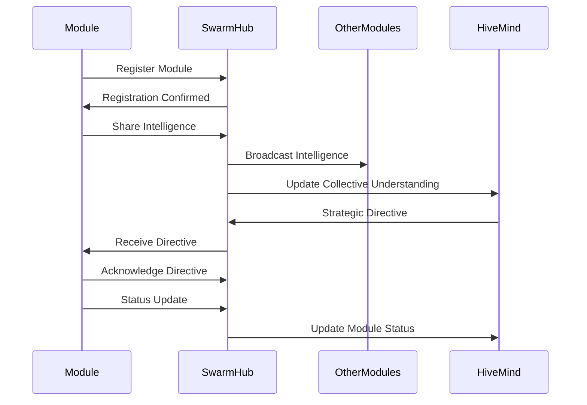
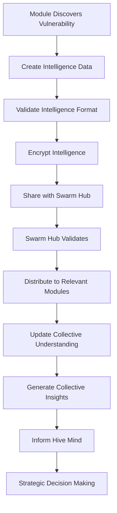
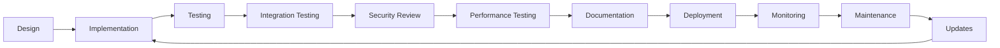

# GODMODE Module Development Specifications

## Overview

This document provides comprehensive technical specifications for developing and integrating modules within the GODMODE system. All modules must adhere to these specifications to ensure seamless swarm intelligence integration.

## Core Module Interface

### Base Module Class

All GODMODE modules must inherit from the base `GODMODEModule` class:

```python
from abc import ABC, abstractmethod
from typing import Dict, List, Any, Optional
from dataclasses import dataclass
from enum import Enum
from datetime import datetime

class ModuleStatus(Enum):
    OFFLINE = "offline"
    INITIALIZING = "initializing"
    ONLINE = "online"
    ACTIVE = "active"
    ERROR = "error"
    MAINTENANCE = "maintenance"

@dataclass
class ModuleMetadata:
    module_id: str
    module_name: str
    version: str
    author: str
    description: str
    capabilities: List[str]
    dependencies: List[str]
    resource_requirements: Dict[str, Any]

class GODMODEModule(ABC):
    """Base class for all GODMODE modules"""
    
    def __init__(self, module_id: str, metadata: ModuleMetadata):
        self.module_id = module_id
        self.metadata = metadata
        self.status = ModuleStatus.OFFLINE
        self.swarm_hub = None
        self.intelligence_buffer = []
        self.last_activity = None
    
    @abstractmethod
    async def initialize(self) -> Dict[str, Any]:
        """Initialize the module and return initialization status"""
        pass
    
    @abstractmethod
    async def execute_testing(self, target_url: str, config: Dict[str, Any]) -> Dict[str, Any]:
        """Execute module-specific security testing"""
        pass
    
    @abstractmethod
    async def cleanup(self) -> Dict[str, Any]:
        """Cleanup module resources"""
        pass
    
    async def register_with_swarm(self, swarm_hub) -> bool:
        """Register module with swarm intelligence hub"""
        pass
    
    async def share_intelligence(self, intelligence_data: Dict[str, Any]) -> None:
        """Share intelligence with the swarm"""
        pass
    
    async def receive_intelligence(self, intelligence_data: Dict[str, Any]) -> None:
        """Receive intelligence from other modules"""
        pass
    
    async def get_status(self) -> Dict[str, Any]:
        """Return current module status and health metrics"""
        pass
```

## Intelligence Data Specifications

### Intelligence Data Format

```python
@dataclass
class IntelligenceData:
    intelligence_id: str
    source_module: str
    target_url: str
    intelligence_type: str
    confidence_score: float  # 0.0 to 1.0
    findings: List[Dict[str, Any]]
    metadata: Dict[str, Any]
    timestamp: datetime
    sharing_scope: str  # "local", "swarm", "global"
    correlation_ids: List[str]

@dataclass
class Finding:
    finding_id: str
    vulnerability_type: str
    severity: str  # "critical", "high", "medium", "low", "info"
    description: str
    evidence: Dict[str, Any]
    remediation: List[str]
    references: List[str]
    custom_fields: Dict[str, Any]
```

### Intelligence Sharing Protocol

```python
class IntelligenceProtocol:
    """Protocol for intelligence sharing between modules"""
    
    @staticmethod
    def create_intelligence_message(
        source_module: str,
        intelligence_data: IntelligenceData,
        target_modules: Optional[List[str]] = None
    ) -> Dict[str, Any]:
        """Create standardized intelligence message"""
        return {
            "message_id": generate_uuid(),
            "message_type": "intelligence_share",
            "source_module": source_module,
            "target_modules": target_modules or ["all"],
            "intelligence_data": asdict(intelligence_data),
            "timestamp": datetime.now().isoformat(),
            "encryption_level": "standard"
        }
    
    @staticmethod
    def validate_intelligence_data(intelligence_data: Dict[str, Any]) -> bool:
        """Validate intelligence data format"""
        required_fields = [
            "intelligence_id", "source_module", "target_url",
            "intelligence_type", "confidence_score", "findings",
            "metadata", "timestamp"
        ]
        return all(field in intelligence_data for field in required_fields)
```

## Module Categories and Specifications

### 1. AI-Powered Detection Modules

#### Base AI Module Interface

```python
class AIDetectionModule(GODMODEModule):
    """Base class for AI-powered detection modules"""
    
    def __init__(self, module_id: str, metadata: ModuleMetadata):
        super().__init__(module_id, metadata)
        self.ai_models = {}
        self.training_data = None
        self.model_performance = {}
    
    @abstractmethod
    async def load_ai_models(self) -> Dict[str, Any]:
        """Load and initialize AI models"""
        pass
    
    @abstractmethod
    async def train_models(self, training_data: Any) -> Dict[str, Any]:
        """Train AI models with new data"""
        pass
    
    @abstractmethod
    async def predict_vulnerabilities(self, target_data: Any) -> List[Dict[str, Any]]:
        """Predict vulnerabilities using AI models"""
        pass
    
    async def update_model_performance(self, results: Dict[str, Any]) -> None:
        """Update model performance metrics"""
        pass
```

#### AI Module Requirements

1. **Model Versioning**: All AI models must be versioned and tracked
2. **Performance Metrics**: Accuracy, precision, recall, F1-score tracking
3. **Explainability**: AI decisions must be explainable
4. **Bias Detection**: Continuous monitoring for model bias
5. **Continuous Learning**: Capability to learn from new data

### 2. Behavioral Analysis Modules

#### Base Behavioral Module Interface

```python
class BehavioralAnalysisModule(GODMODEModule):
    """Base class for behavioral analysis modules"""
    
    def __init__(self, module_id: str, metadata: ModuleMetadata):
        super().__init__(module_id, metadata)
        self.behavioral_models = {}
        self.baseline_profiles = {}
        self.anomaly_detectors = {}
    
    @abstractmethod
    async def establish_baseline(self, target_url: str) -> Dict[str, Any]:
        """Establish behavioral baseline for target"""
        pass
    
    @abstractmethod
    async def detect_anomalies(self, current_behavior: Dict[str, Any]) -> List[Dict[str, Any]]:
        """Detect behavioral anomalies"""
        pass
    
    @abstractmethod
    async def analyze_patterns(self, behavior_data: List[Dict[str, Any]]) -> Dict[str, Any]:
        """Analyze behavioral patterns"""
        pass
```

### 3. Advanced Testing Modules

#### Base Advanced Testing Interface

```python
class AdvancedTestingModule(GODMODEModule):
    """Base class for advanced testing modules"""
    
    def __init__(self, module_id: str, metadata: ModuleMetadata):
        super().__init__(module_id, metadata)
        self.testing_engines = {}
        self.payload_generators = {}
        self.result_analyzers = {}
    
    @abstractmethod
    async def generate_test_vectors(self, target_info: Dict[str, Any]) -> List[Dict[str, Any]]:
        """Generate test vectors for target"""
        pass
    
    @abstractmethod
    async def execute_test_vectors(self, test_vectors: List[Dict[str, Any]]) -> Dict[str, Any]:
        """Execute test vectors against target"""
        pass
    
    @abstractmethod
    async def analyze_results(self, test_results: Dict[str, Any]) -> List[Dict[str, Any]]:
        """Analyze test results for vulnerabilities"""
        pass
```

## Configuration Management

### Module Configuration Schema

```python
@dataclass
class ModuleConfiguration:
    module_id: str
    enabled: bool
    execution_priority: int  # 1-10, higher is more priority
    resource_limits: Dict[str, Any]
    swarm_integration: Dict[str, Any]
    custom_parameters: Dict[str, Any]
    
    # Resource limits
    max_memory_mb: int
    max_cpu_percent: int
    max_execution_time_seconds: int
    max_concurrent_operations: int
    
    # Swarm integration settings
    intelligence_sharing_enabled: bool
    collective_learning_enabled: bool
    swarm_coordination_level: str  # "basic", "standard", "advanced"
    consciousness_participation: bool

class ConfigurationManager:
    """Manager for module configurations"""
    
    @staticmethod
    def load_module_config(module_id: str) -> ModuleConfiguration:
        """Load configuration for specific module"""
        pass
    
    @staticmethod
    def validate_configuration(config: ModuleConfiguration) -> bool:
        """Validate module configuration"""
        pass
    
    @staticmethod
    def update_configuration(module_id: str, config: ModuleConfiguration) -> bool:
        """Update module configuration"""
        pass
```

### Configuration File Format

```yaml
# Example module configuration
module_id: "ai_discovery_v2"
enabled: true
execution_priority: 8
resource_limits:
  max_memory_mb: 4096
  max_cpu_percent: 75
  max_execution_time_seconds: 1800
  max_concurrent_operations: 10
swarm_integration:
  intelligence_sharing_enabled: true
  collective_learning_enabled: true
  swarm_coordination_level: "advanced"
  consciousness_participation: true
custom_parameters:
  ai_models:
    - "neural_fuzzer_v3"
    - "pattern_detector_v2"
  confidence_threshold: 0.8
  learning_rate: 0.001
```

## Testing and Validation

### Module Testing Framework

```python
class ModuleTestFramework:
    """Framework for testing GODMODE modules"""
    
    async def test_module_initialization(self, module: GODMODEModule) -> TestResult:
        """Test module initialization"""
        pass
    
    async def test_swarm_integration(self, module: GODMODEModule) -> TestResult:
        """Test swarm intelligence integration"""
        pass
    
    async def test_intelligence_sharing(self, module: GODMODEModule) -> TestResult:
        """Test intelligence sharing capabilities"""
        pass
    
    async def test_performance_requirements(self, module: GODMODEModule) -> TestResult:
        """Test module performance against requirements"""
        pass
    
    async def test_error_handling(self, module: GODMODEModule) -> TestResult:
        """Test module error handling"""
        pass
    
    async def test_security_compliance(self, module: GODMODEModule) -> TestResult:
        """Test module security compliance"""
        pass

@dataclass
class TestResult:
    test_name: str
    passed: bool
    score: float  # 0.0 to 1.0
    details: Dict[str, Any]
    recommendations: List[str]
    timestamp: datetime
```

### Validation Requirements

#### Functional Validation
1. **Core Functionality**: All core functions must work as specified
2. **Swarm Integration**: Successful integration with swarm intelligence
3. **Intelligence Quality**: High-quality intelligence generation
4. **Error Handling**: Robust error handling and recovery
5. **Performance**: Meeting performance requirements

#### Security Validation
1. **Input Validation**: Proper validation of all inputs
2. **Output Sanitization**: Sanitization of all outputs
3. **Resource Protection**: Protection against resource exhaustion
4. **Privilege Management**: Proper privilege management
5. **Data Protection**: Protection of sensitive data

#### Compliance Validation
1. **Ethical Guidelines**: Adherence to ethical guidelines
2. **Regulatory Compliance**: Compliance with relevant regulations
3. **Privacy Protection**: Proper privacy protection measures
4. **Audit Requirements**: Meeting audit and logging requirements

## Performance Requirements

### Resource Usage Guidelines

```python
class PerformanceRequirements:
    """Performance requirements for GODMODE modules"""
    
    # Resource limits
    MAX_MEMORY_USAGE_MB = 8192
    MAX_CPU_USAGE_PERCENT = 80
    MAX_EXECUTION_TIME_SECONDS = 3600
    MAX_DISK_USAGE_MB = 10240
    MAX_NETWORK_BANDWIDTH_MBPS = 100
    
    # Response time requirements
    MAX_INITIALIZATION_TIME_SECONDS = 30
    MAX_OPERATION_RESPONSE_TIME_SECONDS = 5
    MAX_INTELLIGENCE_SHARING_LATENCY_MS = 100
    
    # Throughput requirements
    MIN_OPERATIONS_PER_SECOND = 10
    MIN_INTELLIGENCE_PROCESSING_RATE = 100  # per second
    
    # Reliability requirements
    MIN_UPTIME_PERCENTAGE = 99.5
    MAX_ERROR_RATE_PERCENTAGE = 0.1
    MIN_SWARM_SYNC_SUCCESS_RATE = 99.0

class PerformanceMonitor:
    """Monitor module performance"""
    
    async def monitor_resource_usage(self, module: GODMODEModule) -> Dict[str, float]:
        """Monitor module resource usage"""
        pass
    
    async def monitor_response_times(self, module: GODMODEModule) -> Dict[str, float]:
        """Monitor module response times"""
        pass
    
    async def monitor_throughput(self, module: GODMODEModule) -> Dict[str, float]:
        """Monitor module throughput"""
        pass
    
    async def monitor_reliability(self, module: GODMODEModule) -> Dict[str, float]:
        """Monitor module reliability metrics"""
        pass
```

## Error Handling and Logging

### Error Handling Framework

```python
class GODMODEException(Exception):
    """Base exception for GODMODE modules"""
    
    def __init__(self, message: str, error_code: str, module_id: str, context: Dict[str, Any] = None):
        super().__init__(message)
        self.error_code = error_code
        self.module_id = module_id
        self.context = context or {}
        self.timestamp = datetime.now()

class ErrorHandler:
    """Centralized error handling for modules"""
    
    async def handle_exception(self, exception: GODMODEException) -> Dict[str, Any]:
        """Handle module exceptions"""
        pass
    
    async def log_error(self, error: Dict[str, Any]) -> None:
        """Log error information"""
        pass
    
    async def notify_swarm(self, error: Dict[str, Any]) -> None:
        """Notify swarm of critical errors"""
        pass
    
    async def attempt_recovery(self, module: GODMODEModule, error: Dict[str, Any]) -> bool:
        """Attempt automatic error recovery"""
        pass
```

### Logging Requirements

```python
class ModuleLogger:
    """Standardized logging for GODMODE modules"""
    
    def __init__(self, module_id: str):
        self.module_id = module_id
        self.logger = self._setup_logger()
    
    def log_initialization(self, status: str, details: Dict[str, Any]) -> None:
        """Log module initialization"""
        pass
    
    def log_operation(self, operation: str, status: str, duration: float, details: Dict[str, Any]) -> None:
        """Log module operations"""
        pass
    
    def log_intelligence_sharing(self, intelligence_id: str, target_modules: List[str], status: str) -> None:
        """Log intelligence sharing activities"""
        pass
    
    def log_swarm_interaction(self, interaction_type: str, details: Dict[str, Any]) -> None:
        """Log swarm interactions"""
        pass
    
    def log_performance_metrics(self, metrics: Dict[str, float]) -> None:
        """Log performance metrics"""
        pass
```

## Security Requirements

### Security Framework

```python
class SecurityManager:
    """Security manager for GODMODE modules"""
    
    async def validate_input(self, input_data: Any) -> bool:
        """Validate and sanitize input data"""
        pass
    
    async def sanitize_output(self, output_data: Any) -> Any:
        """Sanitize output data"""
        pass
    
    async def encrypt_communication(self, data: Dict[str, Any]) -> bytes:
        """Encrypt inter-module communication"""
        pass
    
    async def decrypt_communication(self, encrypted_data: bytes) -> Dict[str, Any]:
        """Decrypt inter-module communication"""
        pass
    
    async def audit_access(self, module_id: str, resource: str, action: str) -> None:
        """Audit module access to resources"""
        pass
    
    async def validate_permissions(self, module_id: str, operation: str) -> bool:
        """Validate module permissions"""
        pass
```

### Security Checklist

1. **Input Validation**
   - [ ] All inputs are validated
   - [ ] SQL injection prevention
   - [ ] XSS prevention
   - [ ] Command injection prevention

2. **Data Protection**
   - [ ] Sensitive data encryption
   - [ ] Secure data storage
   - [ ] Data anonymization
   - [ ] PII protection

3. **Communication Security**
   - [ ] Encrypted communication
   - [ ] Message authentication
   - [ ] Replay attack prevention
   - [ ] Man-in-the-middle protection

4. **Access Control**
   - [ ] Proper authentication
   - [ ] Authorization checks
   - [ ] Privilege separation
   - [ ] Resource access controls

5. **Audit and Monitoring**
   - [ ] Comprehensive logging
   - [ ] Security event monitoring
   - [ ] Anomaly detection
   - [ ] Incident response

## Integration Patterns

### Swarm Integration Pattern



### Intelligence Flow Pattern



## Module Lifecycle

### Development Lifecycle



### Deployment Process

1. **Pre-deployment Validation**
   - Code review and security audit
   - Comprehensive testing
   - Performance validation
   - Documentation review

2. **Deployment Steps**
   - Environment preparation
   - Module installation
   - Configuration validation
   - Swarm integration testing
   - Production deployment

3. **Post-deployment Monitoring**
   - Performance monitoring
   - Error rate monitoring
   - Swarm integration monitoring
   - User feedback collection

## Best Practices

### Development Best Practices

1. **Code Quality**
   - Follow PEP 8 style guidelines
   - Comprehensive docstrings
   - Type hints for all functions
   - Unit test coverage > 90%

2. **Performance Optimization**
   - Async/await for I/O operations
   - Efficient algorithms and data structures
   - Memory management
   - Connection pooling

3. **Error Handling**
   - Graceful error handling
   - Detailed error messages
   - Proper exception hierarchy
   - Recovery mechanisms

4. **Security**
   - Input validation
   - Output sanitization
   - Secure communication
   - Audit logging

### Integration Best Practices

1. **Swarm Integration**
   - Timely intelligence sharing
   - Responsive to swarm directives
   - Efficient resource usage
   - Graceful degradation

2. **Communication**
   - Clear message formats
   - Reliable message delivery
   - Efficient protocols
   - Error handling

3. **Performance**
   - Non-blocking operations
   - Resource optimization
   - Scalable design
   - Monitoring integration

This comprehensive specification ensures that all GODMODE modules maintain consistency, quality, and seamless integration with the swarm intelligence system.