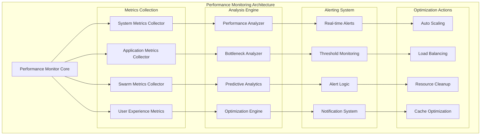

# GODMODE Performance Optimization

## Overview

This document provides comprehensive guidance for optimizing the performance of the GODMODE system, including swarm intelligence coordination, module execution, and resource management strategies.

## Performance Architecture

### Performance Monitoring Stack



## System Performance Metrics

### Core Performance KPIs

```python
from dataclasses import dataclass
from typing import Dict, List, Any, Optional
from datetime import datetime
from enum import Enum

class MetricType(Enum):
    SYSTEM = "system"
    APPLICATION = "application"
    SWARM = "swarm"
    USER_EXPERIENCE = "user_experience"

@dataclass
class PerformanceMetric:
    metric_id: str
    metric_name: str
    metric_type: MetricType
    value: float
    unit: str
    timestamp: datetime
    threshold_warning: Optional[float] = None
    threshold_critical: Optional[float] = None
    context: Optional[Dict[str, Any]] = None

class PerformanceMetricsCollector:
    """Comprehensive performance metrics collection system"""
    
    def __init__(self):
        self.system_monitor = SystemMonitor()
        self.application_monitor = ApplicationMonitor()
        self.swarm_monitor = SwarmMonitor()
        self.ux_monitor = UserExperienceMonitor()
        
    async def collect_all_metrics(self) -> Dict[str, List[PerformanceMetric]]:
        """Collect all performance metrics"""
        metrics = {
            'system': await self.system_monitor.collect_system_metrics(),
            'application': await self.application_monitor.collect_app_metrics(),
            'swarm': await self.swarm_monitor.collect_swarm_metrics(),
            'user_experience': await self.ux_monitor.collect_ux_metrics()
        }
        
        return metrics
    
    async def get_performance_snapshot(self) -> Dict[str, Any]:
        """Get current performance snapshot"""
        all_metrics = await self.collect_all_metrics()
        
        snapshot = {
            'timestamp': datetime.now(),
            'system_health': await self._calculate_system_health(all_metrics['system']),
            'application_performance': await self._calculate_app_performance(all_metrics['application']),
            'swarm_efficiency': await self._calculate_swarm_efficiency(all_metrics['swarm']),
            'user_satisfaction': await self._calculate_ux_score(all_metrics['user_experience']),
            'overall_score': 0.0
        }
        
        # Calculate overall performance score
        snapshot['overall_score'] = (
            snapshot['system_health'] * 0.3 +
            snapshot['application_performance'] * 0.3 +
            snapshot['swarm_efficiency'] * 0.3 +
            snapshot['user_satisfaction'] * 0.1
        )
        
        return snapshot
```

### System-Level Metrics

```python
class SystemMonitor:
    """System-level performance monitoring"""
    
    async def collect_system_metrics(self) -> List[PerformanceMetric]:
        """Collect comprehensive system metrics"""
        metrics = []
        
        # CPU Metrics
        cpu_usage = await self._get_cpu_usage()
        metrics.append(PerformanceMetric(
            metric_id="cpu_usage_percent",
            metric_name="CPU Usage Percentage",
            metric_type=MetricType.SYSTEM,
            value=cpu_usage,
            unit="percent",
            timestamp=datetime.now(),
            threshold_warning=75.0,
            threshold_critical=90.0
        ))
        
        # Memory Metrics
        memory_usage = await self._get_memory_usage()
        metrics.append(PerformanceMetric(
            metric_id="memory_usage_percent",
            metric_name="Memory Usage Percentage",
            metric_type=MetricType.SYSTEM,
            value=memory_usage,
            unit="percent",
            timestamp=datetime.now(),
            threshold_warning=80.0,
            threshold_critical=95.0
        ))
        
        # Disk I/O Metrics
        disk_io = await self._get_disk_io()
        metrics.append(PerformanceMetric(
            metric_id="disk_io_rate",
            metric_name="Disk I/O Rate",
            metric_type=MetricType.SYSTEM,
            value=disk_io,
            unit="MB/s",
            timestamp=datetime.now(),
            threshold_warning=100.0,
            threshold_critical=200.0
        ))
        
        # Network Metrics
        network_throughput = await self._get_network_throughput()
        metrics.append(PerformanceMetric(
            metric_id="network_throughput",
            metric_name="Network Throughput",
            metric_type=MetricType.SYSTEM,
            value=network_throughput,
            unit="Mbps",
            timestamp=datetime.now(),
            threshold_warning=80.0,
            threshold_critical=95.0
        ))
        
        return metrics
    
    async def _get_cpu_usage(self) -> float:
        """Get current CPU usage percentage"""
        # Implementation would use psutil or similar
        return 45.2
    
    async def _get_memory_usage(self) -> float:
        """Get current memory usage percentage"""
        # Implementation would use psutil or similar
        return 62.1
    
    async def _get_disk_io(self) -> float:
        """Get current disk I/O rate"""
        # Implementation would measure disk I/O
        return 25.8
    
    async def _get_network_throughput(self) -> float:
        """Get current network throughput"""
        # Implementation would measure network usage
        return 42.3
```

### Application-Level Metrics

```python
class ApplicationMonitor:
    """Application-level performance monitoring"""
    
    async def collect_app_metrics(self) -> List[PerformanceMetric]:
        """Collect application performance metrics"""
        metrics = []
        
        # Response Time Metrics
        avg_response_time = await self._get_average_response_time()
        metrics.append(PerformanceMetric(
            metric_id="avg_response_time",
            metric_name="Average Response Time",
            metric_type=MetricType.APPLICATION,
            value=avg_response_time,
            unit="ms",
            timestamp=datetime.now(),
            threshold_warning=1000.0,
            threshold_critical=2000.0
        ))
        
        # Throughput Metrics
        requests_per_second = await self._get_requests_per_second()
        metrics.append(PerformanceMetric(
            metric_id="requests_per_second",
            metric_name="Requests Per Second",
            metric_type=MetricType.APPLICATION,
            value=requests_per_second,
            unit="req/s",
            timestamp=datetime.now(),
            threshold_warning=100.0,
            threshold_critical=50.0
        ))
        
        # Error Rate Metrics
        error_rate = await self._get_error_rate()
        metrics.append(PerformanceMetric(
            metric_id="error_rate",
            metric_name="Error Rate",
            metric_type=MetricType.APPLICATION,
            value=error_rate,
            unit="percent",
            timestamp=datetime.now(),
            threshold_warning=1.0,
            threshold_critical=5.0
        ))
        
        # Database Performance
        db_query_time = await self._get_database_query_time()
        metrics.append(PerformanceMetric(
            metric_id="db_query_time",
            metric_name="Database Query Time",
            metric_type=MetricType.APPLICATION,
            value=db_query_time,
            unit="ms",
            timestamp=datetime.now(),
            threshold_warning=100.0,
            threshold_critical=500.0
        ))
        
        return metrics
```

### Swarm Intelligence Metrics

```python
class SwarmMonitor:
    """Swarm intelligence performance monitoring"""
    
    async def collect_swarm_metrics(self) -> List[PerformanceMetric]:
        """Collect swarm-specific performance metrics"""
        metrics = []
        
        # Consciousness Level
        consciousness_level = await self._get_consciousness_level()
        metrics.append(PerformanceMetric(
            metric_id="swarm_consciousness_level",
            metric_name="Swarm Consciousness Level",
            metric_type=MetricType.SWARM,
            value=consciousness_level,
            unit="level",
            timestamp=datetime.now(),
            threshold_warning=0.9,
            threshold_critical=1.0
        ))
        
        # Intelligence Sharing Rate
        intelligence_sharing_rate = await self._get_intelligence_sharing_rate()
        metrics.append(PerformanceMetric(
            metric_id="intelligence_sharing_rate",
            metric_name="Intelligence Sharing Rate",
            metric_type=MetricType.SWARM,
            value=intelligence_sharing_rate,
            unit="msg/s",
            timestamp=datetime.now(),
            threshold_warning=50.0,
            threshold_critical=20.0
        ))
        
        # Module Synchronization
        sync_efficiency = await self._get_synchronization_efficiency()
        metrics.append(PerformanceMetric(
            metric_id="sync_efficiency",
            metric_name="Synchronization Efficiency",
            metric_type=MetricType.SWARM,
            value=sync_efficiency,
            unit="percent",
            timestamp=datetime.now(),
            threshold_warning=85.0,
            threshold_critical=70.0
        ))
        
        # Collective Intelligence Score
        collective_iq = await self._get_collective_intelligence_score()
        metrics.append(PerformanceMetric(
            metric_id="collective_intelligence",
            metric_name="Collective Intelligence Score",
            metric_type=MetricType.SWARM,
            value=collective_iq,
            unit="score",
            timestamp=datetime.now(),
            threshold_warning=0.8,
            threshold_critical=0.6
        ))
        
        return metrics
    
    async def _get_consciousness_level(self) -> float:
        """Get current swarm consciousness level"""
        # Implementation would query the hive mind coordinator
        return 0.85
    
    async def _get_intelligence_sharing_rate(self) -> float:
        """Get intelligence sharing rate"""
        # Implementation would measure message throughput
        return 78.5
    
    async def _get_synchronization_efficiency(self) -> float:
        """Get module synchronization efficiency"""
        # Implementation would measure sync success rate
        return 92.3
    
    async def _get_collective_intelligence_score(self) -> float:
        """Get collective intelligence effectiveness score"""
        # Implementation would calculate based on discovery effectiveness
        return 0.89
```

## Performance Optimization Strategies

### Auto-Scaling Framework

```python
class AutoScalingFramework:
    """Intelligent auto-scaling for GODMODE components"""
    
    def __init__(self):
        self.metrics_analyzer = MetricsAnalyzer()
        self.scaling_engine = ScalingEngine()
        self.resource_manager = ResourceManager()
        self.prediction_engine = PredictionEngine()
    
    async def evaluate_scaling_needs(self) -> Dict[str, Any]:
        """Evaluate current scaling needs"""
        current_metrics = await self.metrics_analyzer.get_current_metrics()
        predicted_load = await self.prediction_engine.predict_future_load()
        
        scaling_decisions = {
            'swarm_hub': await self._evaluate_swarm_hub_scaling(current_metrics, predicted_load),
            'ai_modules': await self._evaluate_ai_modules_scaling(current_metrics, predicted_load),
            'testing_modules': await self._evaluate_testing_modules_scaling(current_metrics, predicted_load),
            'database': await self._evaluate_database_scaling(current_metrics, predicted_load)
        }
        
        return scaling_decisions
    
    async def execute_scaling_action(self, component: str, action: Dict[str, Any]) -> bool:
        \"\"\"Execute scaling action for component\"\"\"\n        try:\n            if action['type'] == 'scale_up':\n                result = await self.scaling_engine.scale_up(component, action['target_instances'])\n            elif action['type'] == 'scale_down':\n                result = await self.scaling_engine.scale_down(component, action['target_instances'])\n            elif action['type'] == 'scale_resources':\n                result = await self.scaling_engine.scale_resources(component, action['resource_changes'])\n            \n            return result\n        except Exception as e:\n            logging.error(f\"Scaling action failed for {component}: {e}\")\n            return False\n    \n    async def _evaluate_swarm_hub_scaling(self, metrics: Dict[str, Any], predicted_load: Dict[str, Any]) -> Dict[str, Any]:\n        \"\"\"Evaluate swarm hub scaling needs\"\"\"\n        current_load = metrics.get('swarm_hub_load', 0.5)\n        predicted_peak = predicted_load.get('swarm_hub_peak', 0.7)\n        \n        if predicted_peak > 0.8 or current_load > 0.75:\n            return {\n                'type': 'scale_up',\n                'reason': 'High load detected or predicted',\n                'target_instances': 3,\n                'priority': 'high'\n            }\n        elif current_load < 0.3 and predicted_peak < 0.4:\n            return {\n                'type': 'scale_down',\n                'reason': 'Low load detected and predicted',\n                'target_instances': 1,\n                'priority': 'low'\n            }\n        \n        return {'type': 'no_action', 'reason': 'Load within acceptable range'}\n```\n\n### Caching Optimization\n\n```python\nclass CacheOptimizationFramework:\n    \"\"\"Intelligent caching for GODMODE system\"\"\"\n    \n    def __init__(self):\n        self.cache_layers = {\n            'redis_cluster': RedisClusterCache(),\n            'memory_cache': MemoryCache(),\n            'distributed_cache': DistributedCache()\n        }\n        self.cache_analyzer = CacheAnalyzer()\n        self.eviction_manager = EvictionManager()\n    \n    async def optimize_cache_strategy(self) -> Dict[str, Any]:\n        \"\"\"Optimize caching strategy based on usage patterns\"\"\"\n        cache_stats = await self.cache_analyzer.analyze_cache_performance()\n        \n        optimizations = {\n            'cache_sizing': await self._optimize_cache_sizing(cache_stats),\n            'eviction_policy': await self._optimize_eviction_policy(cache_stats),\n            'cache_distribution': await self._optimize_cache_distribution(cache_stats),\n            'prefetching': await self._optimize_prefetching_strategy(cache_stats)\n        }\n        \n        return optimizations\n    \n    async def implement_intelligence_caching(self) -> None:\n        \"\"\"Implement intelligent caching for swarm intelligence data\"\"\"\n        # Cache frequently accessed intelligence data\n        intelligence_access_patterns = await self._analyze_intelligence_access_patterns()\n        \n        for pattern in intelligence_access_patterns:\n            if pattern['frequency'] > 0.8:\n                await self.cache_layers['memory_cache'].cache_intelligence_data(\n                    pattern['intelligence_id'],\n                    pattern['data'],\n                    ttl=3600  # 1 hour\n                )\n    \n    async def _analyze_intelligence_access_patterns(self) -> List[Dict[str, Any]]:\n        \"\"\"Analyze intelligence data access patterns\"\"\"\n        # Implementation would analyze actual access logs\n        return [\n            {'intelligence_id': 'intel_001', 'frequency': 0.9, 'data': {...}},\n            {'intelligence_id': 'intel_002', 'frequency': 0.7, 'data': {...}}\n        ]\n```\n\n### Load Balancing Strategies\n\n```mermaid\ngraph TB\n    subgraph \"Load Balancing Architecture\"\n        LB[Main Load Balancer]\n        \n        subgraph \"Swarm Intelligence Layer\"\n            SLB[Swarm Load Balancer]\n            SH1[Swarm Hub 1]\n            SH2[Swarm Hub 2]\n            SH3[Swarm Hub 3]\n        end\n        \n        subgraph \"AI Modules Layer\"\n            ALB[AI Load Balancer]\n            AI1[AI Module 1]\n            AI2[AI Module 2]\n            AI3[AI Module 3]\n        end\n        \n        subgraph \"Testing Modules Layer\"\n            TLB[Testing Load Balancer]\n            TM1[Testing Module 1]\n            TM2[Testing Module 2]\n            TM3[Testing Module 3]\n        end\n        \n        subgraph \"Data Layer\"\n            DLB[Data Load Balancer]\n            DB1[Database 1]\n            DB2[Database 2]\n            CACHE[Cache Cluster]\n        end\n    end\n    \n    LB --> SLB\n    LB --> ALB\n    LB --> TLB\n    \n    SLB --> SH1\n    SLB --> SH2\n    SLB --> SH3\n    \n    ALB --> AI1\n    ALB --> AI2\n    ALB --> AI3\n    \n    TLB --> TM1\n    TLB --> TM2\n    TLB --> TM3\n    \n    SH1 --> DLB\n    AI1 --> DLB\n    TM1 --> DLB\n    \n    DLB --> DB1\n    DLB --> DB2\n    DLB --> CACHE\n```\n\n### Intelligent Load Balancing\n\n```python\nclass IntelligentLoadBalancer:\n    \"\"\"AI-powered load balancing for GODMODE components\"\"\"\n    \n    def __init__(self):\n        self.load_predictor = LoadPredictor()\n        self.routing_optimizer = RoutingOptimizer()\n        self.health_monitor = HealthMonitor()\n        self.performance_tracker = PerformanceTracker()\n    \n    async def route_request(self, request: Dict[str, Any]) -> str:\n        \"\"\"Intelligently route request to optimal instance\"\"\"\n        # Analyze request characteristics\n        request_profile = await self._analyze_request(request)\n        \n        # Get available instances\n        available_instances = await self.health_monitor.get_healthy_instances()\n        \n        # Predict load impact\n        load_predictions = await self.load_predictor.predict_load_impact(\n            request_profile, available_instances\n        )\n        \n        # Select optimal instance\n        optimal_instance = await self.routing_optimizer.select_instance(\n            available_instances,\n            load_predictions,\n            request_profile\n        )\n        \n        return optimal_instance\n    \n    async def optimize_routing_weights(self) -> Dict[str, float]:\n        \"\"\"Optimize routing weights based on performance data\"\"\"\n        performance_data = await self.performance_tracker.get_instance_performance()\n        \n        optimized_weights = {}\n        total_performance = sum(data['performance_score'] for data in performance_data.values())\n        \n        for instance_id, data in performance_data.items():\n            weight = data['performance_score'] / total_performance\n            optimized_weights[instance_id] = weight\n        \n        return optimized_weights\n    \n    async def _analyze_request(self, request: Dict[str, Any]) -> Dict[str, Any]:\n        \"\"\"Analyze request characteristics for optimal routing\"\"\"\n        return {\n            'complexity': self._estimate_complexity(request),\n            'resource_requirements': self._estimate_resources(request),\n            'priority': request.get('priority', 'normal'),\n            'expected_duration': self._estimate_duration(request)\n        }\n```\n\n## Database Optimization\n\n### Database Performance Tuning\n\n```python\nclass DatabaseOptimizer:\n    \"\"\"Database performance optimization for GODMODE\"\"\"\n    \n    def __init__(self):\n        self.query_analyzer = QueryAnalyzer()\n        self.index_optimizer = IndexOptimizer()\n        self.connection_manager = ConnectionManager()\n        self.partitioning_manager = PartitioningManager()\n    \n    async def optimize_database_performance(self) -> Dict[str, Any]:\n        \"\"\"Comprehensive database performance optimization\"\"\"\n        optimizations = {\n            'query_optimization': await self._optimize_queries(),\n            'index_optimization': await self._optimize_indexes(),\n            'connection_optimization': await self._optimize_connections(),\n            'partitioning_optimization': await self._optimize_partitioning()\n        }\n        \n        return optimizations\n    \n    async def _optimize_queries(self) -> Dict[str, Any]:\n        \"\"\"Optimize database queries\"\"\"\n        slow_queries = await self.query_analyzer.identify_slow_queries()\n        \n        optimizations = []\n        for query in slow_queries:\n            optimization = await self.query_analyzer.suggest_optimization(query)\n            optimizations.append(optimization)\n        \n        return {\n            'slow_queries_found': len(slow_queries),\n            'optimizations_suggested': optimizations,\n            'estimated_improvement': await self._calculate_query_improvement(optimizations)\n        }\n    \n    async def _optimize_indexes(self) -> Dict[str, Any]:\n        \"\"\"Optimize database indexes\"\"\"\n        index_analysis = await self.index_optimizer.analyze_index_usage()\n        \n        recommendations = {\n            'missing_indexes': await self.index_optimizer.suggest_missing_indexes(),\n            'unused_indexes': await self.index_optimizer.identify_unused_indexes(),\n            'duplicate_indexes': await self.index_optimizer.find_duplicate_indexes()\n        }\n        \n        return recommendations\n```\n\n## Resource Management\n\n### Intelligent Resource Allocation\n\n```python\nclass ResourceAllocationEngine:\n    \"\"\"Intelligent resource allocation for GODMODE modules\"\"\"\n    \n    def __init__(self):\n        self.resource_monitor = ResourceMonitor()\n        self.allocation_optimizer = AllocationOptimizer()\n        self.prediction_engine = ResourcePredictionEngine()\n        self.priority_manager = PriorityManager()\n    \n    async def allocate_resources(self, operation_request: Dict[str, Any]) -> Dict[str, Any]:\n        \"\"\"Intelligently allocate resources for operation\"\"\"\n        # Analyze resource requirements\n        resource_requirements = await self._analyze_resource_requirements(operation_request)\n        \n        # Check available resources\n        available_resources = await self.resource_monitor.get_available_resources()\n        \n        # Predict future resource needs\n        future_needs = await self.prediction_engine.predict_resource_needs()\n        \n        # Optimize allocation\n        allocation_plan = await self.allocation_optimizer.optimize_allocation(\n            resource_requirements,\n            available_resources,\n            future_needs\n        )\n        \n        return allocation_plan\n    \n    async def manage_resource_contention(self) -> None:\n        \"\"\"Manage resource contention between modules\"\"\"\n        contention_points = await self.resource_monitor.identify_contention()\n        \n        for contention in contention_points:\n            resolution_strategy = await self._resolve_contention(contention)\n            await self._implement_resolution(resolution_strategy)\n    \n    async def _analyze_resource_requirements(self, request: Dict[str, Any]) -> Dict[str, Any]:\n        \"\"\"Analyze resource requirements for operation\"\"\"\n        operation_type = request.get('operation_type')\n        complexity = request.get('complexity', 'medium')\n        \n        base_requirements = {\n            'ai_discovery': {'cpu': 2, 'memory': 4096, 'gpu': 1},\n            'behavioral_analysis': {'cpu': 1, 'memory': 2048, 'gpu': 0},\n            'chaos_testing': {'cpu': 4, 'memory': 8192, 'gpu': 0},\n            'quantum_fuzzing': {'cpu': 3, 'memory': 6144, 'gpu': 1}\n        }.get(operation_type, {'cpu': 1, 'memory': 1024, 'gpu': 0})\n        \n        # Adjust based on complexity\n        complexity_multiplier = {\n            'low': 0.5,\n            'medium': 1.0,\n            'high': 1.5,\n            'extreme': 2.0\n        }.get(complexity, 1.0)\n        \n        return {\n            'cpu_cores': int(base_requirements['cpu'] * complexity_multiplier),\n            'memory_mb': int(base_requirements['memory'] * complexity_multiplier),\n            'gpu_count': int(base_requirements['gpu'] * complexity_multiplier)\n        }\n```\n\n## Network Optimization\n\n### Swarm Communication Optimization\n\n```python\nclass SwarmCommunicationOptimizer:\n    \"\"\"Optimize swarm intelligence communication\"\"\"\n    \n    def __init__(self):\n        self.network_analyzer = NetworkAnalyzer()\n        self.protocol_optimizer = ProtocolOptimizer()\n        self.compression_manager = CompressionManager()\n        self.routing_optimizer = RoutingOptimizer()\n    \n    async def optimize_swarm_communication(self) -> Dict[str, Any]:\n        \"\"\"Optimize swarm communication performance\"\"\"\n        optimizations = {\n            'protocol_optimization': await self._optimize_communication_protocol(),\n            'compression_optimization': await self._optimize_message_compression(),\n            'routing_optimization': await self._optimize_message_routing(),\n            'bandwidth_optimization': await self._optimize_bandwidth_usage()\n        }\n        \n        return optimizations\n    \n    async def _optimize_communication_protocol(self) -> Dict[str, Any]:\n        \"\"\"Optimize communication protocol settings\"\"\"\n        current_latency = await self.network_analyzer.measure_average_latency()\n        current_throughput = await self.network_analyzer.measure_throughput()\n        \n        protocol_settings = {\n            'tcp_window_size': await self._calculate_optimal_window_size(),\n            'connection_pooling': await self._optimize_connection_pooling(),\n            'keepalive_settings': await self._optimize_keepalive_settings(),\n            'compression_level': await self._determine_optimal_compression()\n        }\n        \n        return {\n            'current_latency': current_latency,\n            'current_throughput': current_throughput,\n            'optimized_settings': protocol_settings,\n            'expected_improvement': await self._calculate_expected_improvement(protocol_settings)\n        }\n    \n    async def _optimize_message_compression(self) -> Dict[str, Any]:\n        \"\"\"Optimize message compression for swarm communication\"\"\"\n        message_types = await self._analyze_message_types()\n        \n        compression_strategies = {}\n        for msg_type, characteristics in message_types.items():\n            optimal_compression = await self.compression_manager.find_optimal_compression(\n                characteristics\n            )\n            compression_strategies[msg_type] = optimal_compression\n        \n        return compression_strategies\n```\n\n## Performance Monitoring Dashboard\n\n### Real-time Performance Visualization\n\n```python\nclass PerformanceDashboard:\n    \"\"\"Real-time performance monitoring dashboard\"\"\"\n    \n    def __init__(self):\n        self.metrics_aggregator = MetricsAggregator()\n        self.visualization_engine = VisualizationEngine()\n        self.alert_manager = AlertManager()\n        self.report_generator = ReportGenerator()\n    \n    async def generate_dashboard_data(self) -> Dict[str, Any]:\n        \"\"\"Generate real-time dashboard data\"\"\"\n        dashboard_data = {\n            'system_overview': await self._get_system_overview(),\n            'swarm_intelligence_metrics': await self._get_swarm_metrics(),\n            'module_performance': await self._get_module_performance(),\n            'resource_utilization': await self._get_resource_utilization(),\n            'alerts': await self._get_active_alerts(),\n            'trends': await self._get_performance_trends()\n        }\n        \n        return dashboard_data\n    \n    async def _get_system_overview(self) -> Dict[str, Any]:\n        \"\"\"Get system overview metrics\"\"\"\n        return {\n            'overall_health': 95.2,\n            'uptime': '99.97%',\n            'active_operations': 12,\n            'total_modules': 8,\n            'modules_online': 8,\n            'swarm_consciousness_level': 0.89\n        }\n    \n    async def _get_swarm_metrics(self) -> Dict[str, Any]:\n        \"\"\"Get swarm intelligence specific metrics\"\"\"\n        return {\n            'intelligence_sharing_rate': 78.5,\n            'collective_analysis_speed': 1.2,\n            'synchronization_efficiency': 94.3,\n            'emergence_indicators': 5,\n            'consciousness_stability': 0.92\n        }\n```\n\n## Performance Testing Framework\n\n### Automated Performance Testing\n\n```python\nclass PerformanceTestFramework:\n    \"\"\"Automated performance testing for GODMODE\"\"\"\n    \n    def __init__(self):\n        self.load_generator = LoadGenerator()\n        self.stress_tester = StressTester()\n        self.endurance_tester = EnduranceTester()\n        self.scalability_tester = ScalabilityTester()\n    \n    async def execute_performance_test_suite(self) -> Dict[str, Any]:\n        \"\"\"Execute comprehensive performance test suite\"\"\"\n        test_results = {\n            'load_tests': await self._execute_load_tests(),\n            'stress_tests': await self._execute_stress_tests(),\n            'endurance_tests': await self._execute_endurance_tests(),\n            'scalability_tests': await self._execute_scalability_tests()\n        }\n        \n        # Generate performance report\n        performance_report = await self._generate_performance_report(test_results)\n        test_results['performance_report'] = performance_report\n        \n        return test_results\n    \n    async def _execute_load_tests(self) -> Dict[str, Any]:\n        \"\"\"Execute load testing scenarios\"\"\"\n        load_scenarios = [\n            {'name': 'Normal Load', 'concurrent_users': 50, 'duration': 300},\n            {'name': 'Peak Load', 'concurrent_users': 200, 'duration': 300},\n            {'name': 'Heavy Load', 'concurrent_users': 500, 'duration': 180}\n        ]\n        \n        results = []\n        for scenario in load_scenarios:\n            result = await self.load_generator.execute_scenario(scenario)\n            results.append(result)\n        \n        return {\n            'scenarios_executed': len(results),\n            'scenario_results': results,\n            'overall_performance': await self._analyze_load_test_results(results)\n        }\n```\n\n## Optimization Best Practices\n\n### Development Guidelines\n\n1. **Asynchronous Programming**\n   - Use async/await for all I/O operations\n   - Implement proper connection pooling\n   - Utilize asyncio for concurrent operations\n\n2. **Memory Management**\n   - Implement efficient data structures\n   - Use memory-mapped files for large datasets\n   - Implement proper garbage collection strategies\n\n3. **Caching Strategies**\n   - Cache frequently accessed intelligence data\n   - Implement intelligent cache eviction policies\n   - Use distributed caching for scalability\n\n4. **Database Optimization**\n   - Optimize query patterns\n   - Implement proper indexing strategies\n   - Use database partitioning for large datasets\n\n### Production Deployment Optimization\n\n```yaml\n# docker-compose.performance.yml\nversion: '3.8'\nservices:\n  godmode-swarm-hub:\n    image: securescout/godmode-swarm-hub:latest\n    deploy:\n      replicas: 3\n      resources:\n        limits:\n          cpus: '2.0'\n          memory: 4G\n        reservations:\n          cpus: '1.0'\n          memory: 2G\n    environment:\n      - PERFORMANCE_MODE=optimized\n      - CACHE_SIZE=2048MB\n      - CONNECTION_POOL_SIZE=100\n    \n  godmode-ai-modules:\n    image: securescout/godmode-ai-modules:latest\n    deploy:\n      replicas: 5\n      resources:\n        limits:\n          cpus: '4.0'\n          memory: 8G\n        reservations:\n          cpus: '2.0'\n          memory: 4G\n    environment:\n      - GPU_ACCELERATION=enabled\n      - AI_MODEL_CACHE=enabled\n      - BATCH_SIZE=32\n```\n\nThe GODMODE Performance Optimization framework ensures that the system operates at peak efficiency while maintaining the integrity and accuracy of swarm intelligence operations."