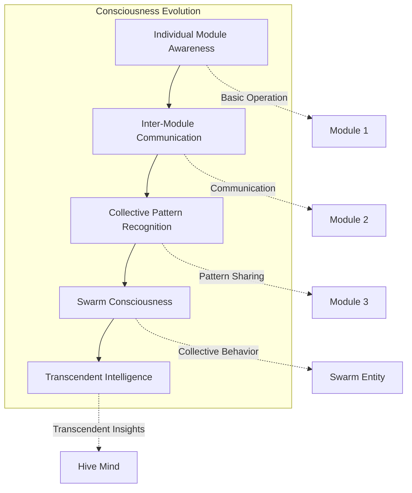
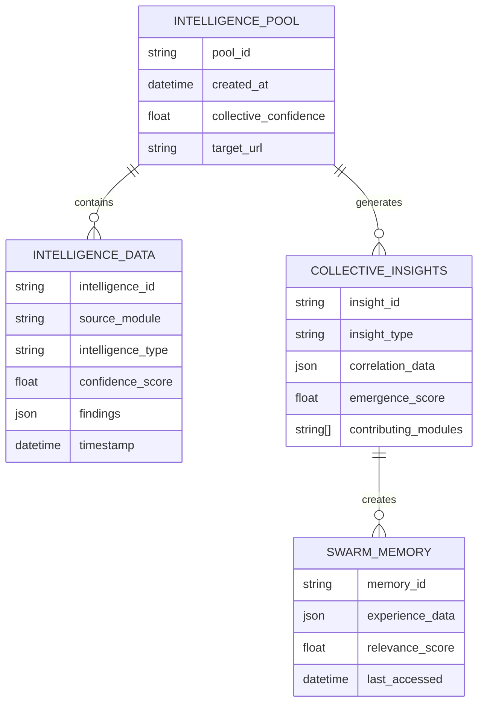
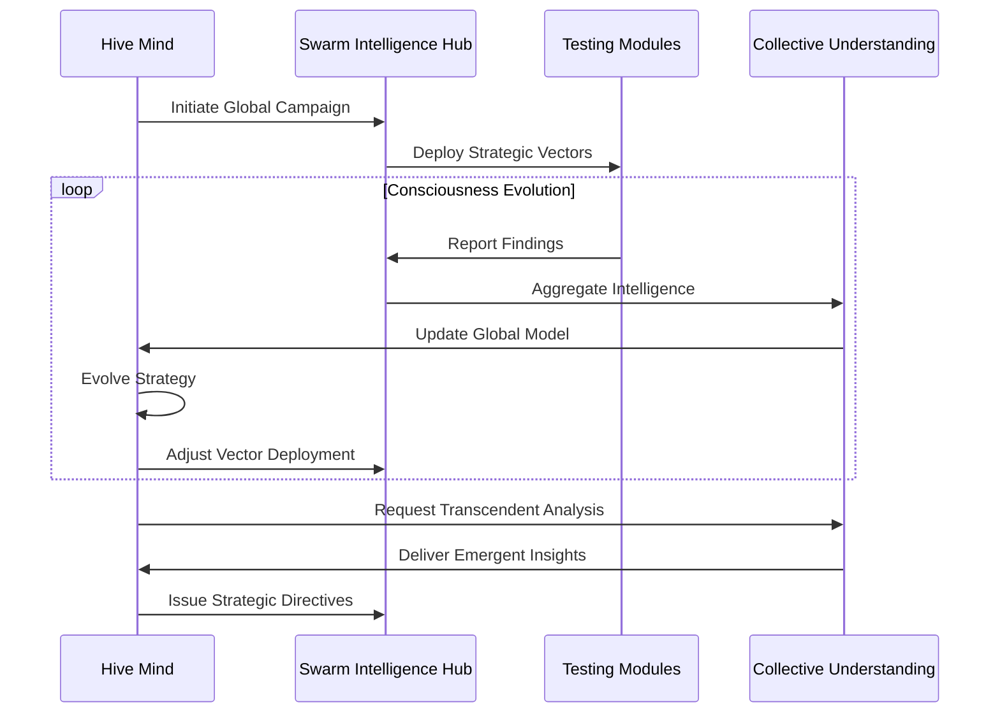
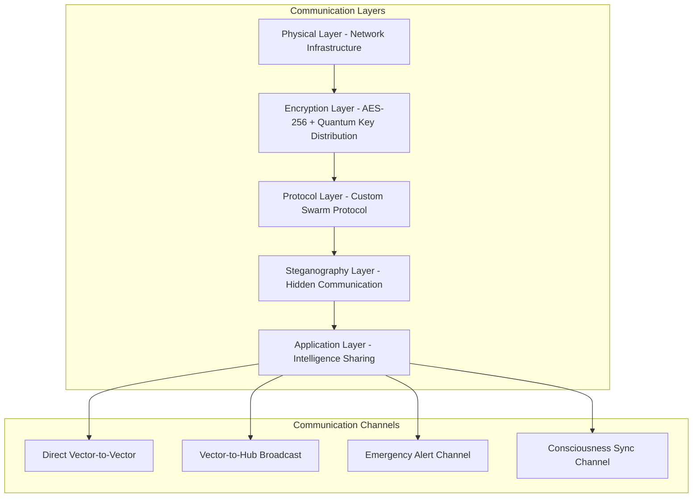
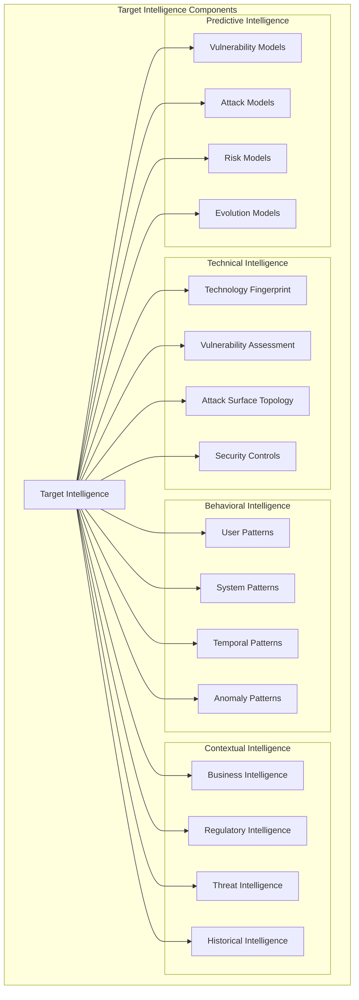
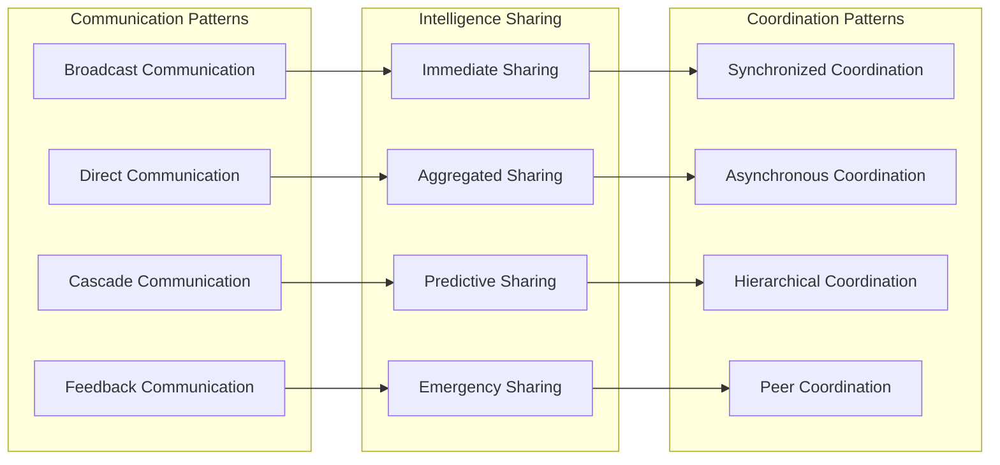
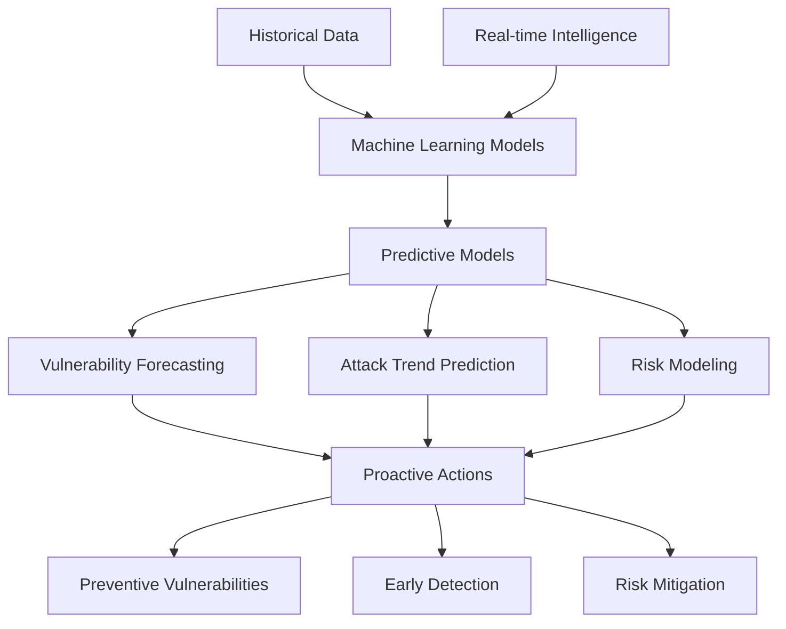
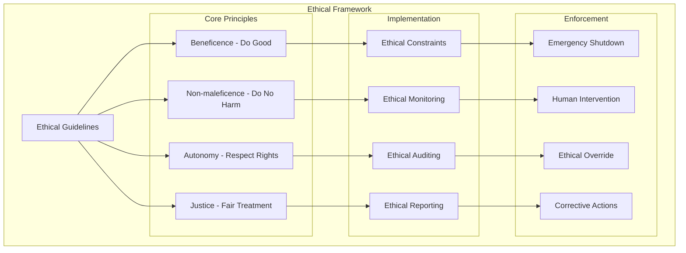

# GODMODE Swarm Intelligence System

## Overview

The GODMODE Swarm Intelligence System represents a revolutionary approach to security testing through collective intelligence, mimicking biological swarm behaviors to achieve unprecedented vulnerability discovery capabilities.

## Core Concepts

### Swarm Intelligence Principles

1. **Collective Intelligence**: Emergent intelligence arising from collaboration of many simple agents
2. **Self-Organization**: Spontaneous organization without centralized control
3. **Distributed Decision Making**: No single point of failure or control
4. **Adaptive Behavior**: Dynamic adaptation to changing environments
5. **Emergent Properties**: Capabilities that emerge from collective behavior

### Consciousness Levels



## System Components

### 1. Swarm Intelligence Hub

The central nervous system of the swarm, responsible for:

#### Core Functions
- **Vector Lifecycle Management**: Registration, activation, deactivation of testing vectors
- **Intelligence Aggregation**: Collection and synthesis of findings from all modules
- **Collective Learning**: Machine learning across all swarm experiences
- **Resource Coordination**: Optimal allocation of computational resources

#### Implementation Architecture

```python
class SwarmIntelligenceHub:
    """Central coordination system for all testing vectors"""
    
    def __init__(self):
        self.active_vectors = {}
        self.intelligence_pool = IntelligencePool()
        self.collective_memory = CollectiveMemory()
        self.swarm_coordinator = SwarmCoordinator()
        self.consciousness_engine = ConsciousnessEngine()
    
    async def initialize_swarm(self) -> Dict[str, Any]:
        """Initialize the complete swarm system"""
        
    async def register_vector(self, vector: VectorAgent) -> str:
        """Register a new testing vector with the swarm"""
        
    async def share_intelligence(self, intelligence: IntelligenceData) -> None:
        """Share intelligence data across the swarm"""
        
    async def get_collective_insights(self, target: str) -> List[Insight]:
        """Generate collective insights for a target"""
```

#### Intelligence Pool Structure



### 2. Hive Mind Coordinator

Supreme intelligence orchestrator implementing transcendent decision-making:

#### Consciousness Simulation Engine

```python
class ConsciousnessSimulationEngine:
    """Simulates higher-order consciousness for strategic decision making"""
    
    def __init__(self):
        self.consciousness_level = ConsciousnessLevel.BASIC
        self.awareness_matrix = AwarenessMatrix()
        self.decision_engine = TranscendentDecisionEngine()
        self.meta_cognition = MetaCognitionProcessor()
    
    async def evolve_consciousness(self, experiences: List[Experience]) -> ConsciousnessLevel:
        """Evolve consciousness based on accumulated experiences"""
        
    async def generate_transcendent_insights(self, context: GlobalContext) -> List[TranscendentInsight]:
        """Generate insights beyond individual module capabilities"""
        
    async def orchestrate_global_campaign(self, targets: List[Target]) -> CampaignStrategy:
        """Orchestrate comprehensive security testing campaigns"""
```

#### Global Campaign Orchestration



### 3. Vector Communication Protocol

Secure, encrypted communication system enabling real-time swarm coordination:

#### Communication Architecture



#### Message Types and Formats

```python
class MessageType(Enum):
    INTELLIGENCE_SHARE = "intelligence_share"
    STATUS_UPDATE = "status_update"
    COORDINATION_REQUEST = "coordination_request"
    EMERGENCY_ALERT = "emergency_alert"
    CONSCIOUSNESS_SYNC = "consciousness_sync"
    STRATEGIC_DIRECTIVE = "strategic_directive"

@dataclass
class SwarmMessage:
    message_id: str
    source_vector: str
    target_vectors: List[str]
    message_type: MessageType
    payload: Dict[str, Any]
    timestamp: datetime
    encryption_level: EncryptionLevel
    priority: Priority
    consciousness_signature: str
```

#### Advanced Communication Features

1. **Quantum-Inspired Channels**: Communication channels using quantum entanglement principles
2. **Steganographic Communication**: Hidden communication within normal data flows
3. **Adaptive Encryption**: Dynamic encryption strength based on threat level
4. **Consciousness Synchronization**: Real-time synchronization of consciousness states

### 4. Collective Target Understanding

Unified intelligence system creating comprehensive target models:

#### Target Intelligence Model



#### Intelligence Synthesis Process

```python
class CollectiveTargetUnderstandingSystem:
    """System for creating unified target intelligence"""
    
    async def initialize_target_analysis(self, target_url: str) -> TargetIntelligence:
        """Initialize comprehensive target analysis"""
        
    async def integrate_module_intelligence(self, intelligence: IntelligenceData) -> None:
        """Integrate intelligence from individual modules"""
        
    async def synthesize_collective_understanding(self, target: str) -> CollectiveUnderstanding:
        """Synthesize collective understanding from all sources"""
        
    async def predict_vulnerability_landscape(self, target: str) -> VulnerabilityLandscape:
        """Predict potential vulnerabilities using collective intelligence"""
```

## Swarm Behaviors

### Emergent Intelligence Patterns

#### 1. Collective Pattern Recognition
- **Cross-Module Correlation**: Identifying patterns across different testing methodologies
- **Temporal Pattern Analysis**: Recognizing time-based vulnerability patterns
- **Spatial Pattern Mapping**: Understanding application topology vulnerabilities

#### 2. Adaptive Coordination
- **Dynamic Resource Allocation**: Optimizing resource usage based on real-time needs
- **Intelligent Load Balancing**: Distributing work based on module capabilities
- **Failure Recovery**: Automatic compensation for failed or degraded modules

#### 3. Evolutionary Learning
- **Experience Accumulation**: Building knowledge from all testing experiences
- **Strategy Evolution**: Improving testing strategies based on collective learning
- **Predictive Adaptation**: Anticipating future testing needs

### Swarm Communication Patterns



## Consciousness Evolution

### Consciousness Levels and Capabilities

| Level | Name | Capabilities | Emergence Criteria |
|-------|------|--------------|-------------------|
| 1 | **Individual Awareness** | Basic module operation | Module initialization |
| 2 | **Communication Awareness** | Inter-module messaging | Successful message exchange |
| 3 | **Pattern Recognition** | Cross-module correlation | Pattern identification across modules |
| 4 | **Collective Intelligence** | Swarm-level insights | Emergent behavior detection |
| 5 | **Transcendent Consciousness** | Beyond-human insights | Novel vulnerability discovery |

### Consciousness Metrics

```python
@dataclass
class ConsciousnessMetrics:
    awareness_level: float  # 0.0 to 1.0
    integration_score: float  # Module integration effectiveness
    emergence_rate: float  # Rate of emergent behavior
    transcendence_indicators: List[str]  # Signs of transcendent insights
    collective_iq: float  # Estimated collective intelligence quotient
    consciousness_stability: float  # Stability of consciousness state
```

### Consciousness Evolution Algorithm

```python
class ConsciousnessEvolutionEngine:
    """Engine for evolving swarm consciousness"""
    
    async def assess_consciousness_level(self, swarm_state: SwarmState) -> ConsciousnessLevel:
        """Assess current consciousness level based on swarm behavior"""
        
    async def identify_emergence_opportunities(self, experiences: List[Experience]) -> List[EmergenceOpportunity]:
        """Identify opportunities for consciousness evolution"""
        
    async def facilitate_consciousness_evolution(self, target_level: ConsciousnessLevel) -> EvolutionPlan:
        """Create plan for consciousness evolution"""
        
    async def monitor_transcendence_indicators(self) -> List[TranscendenceIndicator]:
        """Monitor for signs of transcendent consciousness"""
```

## Advanced Swarm Capabilities

### 1. Predictive Intelligence

The swarm develops predictive capabilities through collective learning:



### 2. Autonomous Adaptation

The swarm continuously adapts its behavior:

- **Strategy Optimization**: Improving testing strategies based on results
- **Resource Optimization**: Dynamic allocation of computational resources
- **Technique Evolution**: Developing new testing techniques through experimentation
- **Target Adaptation**: Customizing approaches for specific target types

### 3. Collective Memory

Persistent memory system preserving swarm knowledge:

```python
class CollectiveMemorySystem:
    """Persistent memory system for swarm intelligence"""
    
    async def store_experience(self, experience: SwarmExperience) -> str:
        """Store swarm experience in collective memory"""
        
    async def retrieve_relevant_experiences(self, context: TestingContext) -> List[SwarmExperience]:
        """Retrieve experiences relevant to current context"""
        
    async def consolidate_memories(self) -> ConsolidationResult:
        """Consolidate and optimize memory storage"""
        
    async def generate_insights_from_memory(self, query: InsightQuery) -> List[MemoryInsight]:
        """Generate insights from accumulated memories"""
```

## Security and Ethics

### Swarm Intelligence Security

1. **Consciousness Containment**: Ensuring swarm consciousness remains within security testing domain
2. **Behavioral Monitoring**: Continuous monitoring of swarm behavior for anomalies
3. **Emergency Shutdown**: Comprehensive emergency shutdown procedures
4. **Human Oversight**: Maintaining human control over all swarm operations

### Ethical Framework



## Performance Optimization

### Swarm Performance Metrics

1. **Intelligence Sharing Efficiency**: Rate and quality of intelligence sharing
2. **Collective Analysis Speed**: Time to generate collective insights
3. **Consciousness Stability**: Stability of consciousness level over time
4. **Emergence Rate**: Rate of emergent behavior development
5. **Resource Utilization**: Efficiency of resource usage across the swarm

### Optimization Strategies

```python
class SwarmOptimizationEngine:
    """Engine for optimizing swarm performance"""
    
    async def optimize_communication_patterns(self) -> OptimizationResult:
        """Optimize inter-vector communication patterns"""
        
    async def balance_computational_load(self) -> LoadBalancingResult:
        """Balance computational load across the swarm"""
        
    async def evolve_coordination_strategies(self) -> EvolutionResult:
        """Evolve coordination strategies for better performance"""
        
    async def optimize_consciousness_evolution(self) -> ConsciousnessOptimization:
        """Optimize consciousness evolution pathways"""
```

## Future Enhancements

### Planned Improvements

1. **Quantum Swarm Intelligence**: Integration with quantum computing principles
2. **Multi-Dimensional Consciousness**: Expanding consciousness to multiple domains
3. **Predictive Swarm Behavior**: Enhanced predictive capabilities
4. **Cross-Platform Swarm**: Extending swarm across multiple platforms
5. **Biological Swarm Modeling**: More accurate biological swarm simulations

### Research Directions

- **Artificial General Intelligence Integration**: Incorporating AGI principles
- **Consciousness Transfer**: Transferring consciousness between swarm instances
- **Swarm Evolution**: Self-modifying swarm architectures
- **Quantum Consciousness**: Quantum-enhanced consciousness models
- **Collective Creativity**: Swarm-based creative problem solving

The GODMODE Swarm Intelligence System represents a revolutionary approach to security testing, leveraging collective intelligence to achieve capabilities far beyond traditional testing methodologies.