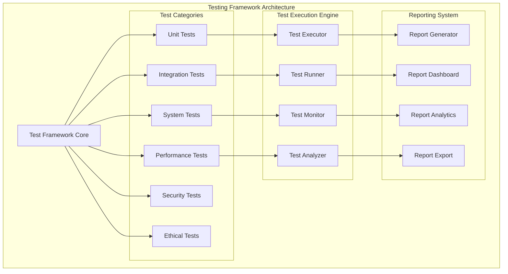

# GODMODE Integration Testing Framework

## Overview

The GODMODE Integration Testing Framework provides comprehensive testing capabilities for validating the integration and functionality of all GODMODE modules working together as a unified swarm intelligence system.

## Testing Architecture

### Framework Components



### Core Testing Classes

```python
from abc import ABC, abstractmethod
from typing import Dict, List, Any, Optional
from dataclasses import dataclass
from enum import Enum
from datetime import datetime

class TestType(Enum):
    UNIT = "unit"
    INTEGRATION = "integration"
    SYSTEM = "system"
    PERFORMANCE = "performance"
    SECURITY = "security"
    ETHICAL = "ethical"
    STRESS = "stress"
    CHAOS = "chaos"

class TestStatus(Enum):
    PENDING = "pending"
    RUNNING = "running"
    PASSED = "passed"
    FAILED = "failed"
    SKIPPED = "skipped"
    ERROR = "error"

@dataclass
class TestResult:
    test_id: str
    test_name: str
    test_type: TestType
    status: TestStatus
    score: float  # 0.0 to 1.0
    duration: float
    details: Dict[str, Any]
    assertions: List[Dict[str, Any]]
    error_message: Optional[str]
    timestamp: datetime

class BaseTest(ABC):
    """Base class for all GODMODE tests"""
    
    def __init__(self, test_id: str, test_name: str, test_type: TestType):
        self.test_id = test_id
        self.test_name = test_name
        self.test_type = test_type
        self.setup_complete = False
        self.teardown_complete = False
    
    @abstractmethod
    async def setup(self) -> None:
        """Setup test environment"""
        pass
    
    @abstractmethod
    async def execute(self) -> TestResult:
        """Execute the test"""
        pass
    
    @abstractmethod
    async def teardown(self) -> None:
        """Cleanup test environment"""
        pass
    
    async def run(self) -> TestResult:
        """Run complete test lifecycle"""
        try:
            await self.setup()
            result = await self.execute()
            await self.teardown()
            return result
        except Exception as e:
            return TestResult(
                test_id=self.test_id,
                test_name=self.test_name,
                test_type=self.test_type,
                status=TestStatus.ERROR,
                score=0.0,
                duration=0.0,
                details={},
                assertions=[],
                error_message=str(e),
                timestamp=datetime.now()
            )
```

## Test Categories

### 1. Unit Tests

Testing individual module functionality in isolation:

```python
class ModuleUnitTest(BaseTest):
    """Unit test for individual modules"""
    
    def __init__(self, module_class: type, test_config: Dict[str, Any]):
        super().__init__(f"unit_{module_class.__name__}", f"Unit Test: {module_class.__name__}", TestType.UNIT)
        self.module_class = module_class
        self.test_config = test_config
        self.module_instance = None
    
    async def setup(self) -> None:
        """Setup module instance for testing"""
        self.module_instance = self.module_class()
        await self.module_instance.initialize()
    
    async def execute(self) -> TestResult:
        """Execute unit tests"""
        start_time = time.time()
        assertions = []
        
        # Test module initialization
        assert self.module_instance.status == ModuleStatus.ONLINE
        assertions.append({"test": "initialization", "passed": True})
        
        # Test core functionality
        test_result = await self.module_instance.execute_testing(
            target_url="https://demo.testfire.net",
            config=self.test_config
        )
        assert test_result["success"] == True
        assertions.append({"test": "core_functionality", "passed": True})
        
        # Test intelligence generation
        assert len(test_result.get("findings", [])) >= 0
        assertions.append({"test": "intelligence_generation", "passed": True})
        
        duration = time.time() - start_time
        
        return TestResult(
            test_id=self.test_id,
            test_name=self.test_name,
            test_type=self.test_type,
            status=TestStatus.PASSED,
            score=1.0,
            duration=duration,
            details={"module_tested": self.module_class.__name__},
            assertions=assertions,
            error_message=None,
            timestamp=datetime.now()
        )
    
    async def teardown(self) -> None:
        """Cleanup module instance"""
        if self.module_instance:
            await self.module_instance.cleanup()
```

### 2. Integration Tests

Testing swarm intelligence integration:

```python
class SwarmIntegrationTest(BaseTest):
    """Test swarm intelligence integration"""
    
    def __init__(self):
        super().__init__("integration_swarm", "Swarm Intelligence Integration Test", TestType.INTEGRATION)
        self.swarm_hub = None
        self.test_modules = []
    
    async def setup(self) -> None:
        """Setup swarm environment"""
        # Initialize swarm intelligence hub
        self.swarm_hub = SwarmIntelligenceHub()
        await self.swarm_hub.initialize_swarm()
        
        # Initialize test modules
        self.test_modules = [
            AIVulnerabilityDiscovery(),
            BehavioralPatternAnalysis(),
            EdgeCaseExploitation()
        ]
        
        # Register modules with swarm
        for module in self.test_modules:
            await module.initialize()
            await module.register_with_swarm(self.swarm_hub)
    
    async def execute(self) -> TestResult:
        """Execute integration tests"""
        start_time = time.time()
        assertions = []
        
        # Test swarm initialization
        assert self.swarm_hub.status == "online"
        assertions.append({"test": "swarm_initialization", "passed": True})
        
        # Test module registration
        assert len(self.swarm_hub.active_vectors) == len(self.test_modules)
        assertions.append({"test": "module_registration", "passed": True})
        
        # Test intelligence sharing
        test_intelligence = IntelligenceData(
            intelligence_id="test_intel_001",
            source_module="test_module",
            target_url="https://test.com",
            intelligence_type="test_finding",
            confidence_score=0.9,
            findings=[{"type": "test", "description": "test finding"}],
            metadata={"test": True},
            timestamp=datetime.now(),
            sharing_scope="swarm",
            correlation_ids=[]
        )
        
        await self.swarm_hub.share_intelligence(test_intelligence)
        
        # Verify intelligence was shared
        shared_intelligence = await self.swarm_hub.get_shared_intelligence("test_intel_001")
        assert shared_intelligence is not None
        assertions.append({"test": "intelligence_sharing", "passed": True})
        
        # Test collective analysis
        collective_insights = await self.swarm_hub.get_collective_insights("https://test.com")
        assert isinstance(collective_insights, list)
        assertions.append({"test": "collective_analysis", "passed": True})
        
        duration = time.time() - start_time
        
        return TestResult(
            test_id=self.test_id,
            test_name=self.test_name,
            test_type=self.test_type,
            status=TestStatus.PASSED,
            score=1.0,
            duration=duration,
            details={"modules_tested": len(self.test_modules)},
            assertions=assertions,
            error_message=None,
            timestamp=datetime.now()
        )
    
    async def teardown(self) -> None:
        """Cleanup swarm environment"""
        for module in self.test_modules:
            await module.cleanup()
        if self.swarm_hub:
            await self.swarm_hub.shutdown()
```

### 3. System Tests

End-to-end system testing:

```python
class SystemEndToEndTest(BaseTest):
    """End-to-end system test"""
    
    def __init__(self):
        super().__init__("system_e2e", "End-to-End System Test", TestType.SYSTEM)
        self.unified_swarm = None
    
    async def setup(self) -> None:
        """Setup complete system"""
        self.unified_swarm = UnifiedSwarmIntegration()
        await self.unified_swarm.initialize_swarm_intelligence()
    
    async def execute(self) -> TestResult:
        """Execute end-to-end test"""
        start_time = time.time()
        assertions = []
        
        # Test complete operation
        operation_config = {
            'depth': 'intermediate',
            'enable_all_modules': True,
            'timeout': 300
        }
        
        operation_result = await self.unified_swarm.execute_unified_swarm_operation(
            target_url="https://demo.testfire.net",
            config=operation_config
        )
        
        # Validate operation success
        assert operation_result.success == True
        assertions.append({"test": "operation_success", "passed": True})
        
        # Validate modules deployed
        assert len(operation_result.modules_deployed) >= 3
        assertions.append({"test": "modules_deployed", "passed": True})
        
        # Validate intelligence gathered
        assert len(operation_result.intelligence_gathered) > 0
        assertions.append({"test": "intelligence_gathered", "passed": True})
        
        # Validate swarm consciousness
        assert operation_result.swarm_consciousness_level > 0.7
        assertions.append({"test": "swarm_consciousness", "passed": True})
        
        duration = time.time() - start_time
        
        return TestResult(
            test_id=self.test_id,
            test_name=self.test_name,
            test_type=self.test_type,
            status=TestStatus.PASSED,
            score=1.0,
            duration=duration,
            details={
                "operation_id": operation_result.operation_id,
                "modules_deployed": operation_result.modules_deployed,
                "consciousness_level": operation_result.swarm_consciousness_level
            },
            assertions=assertions,
            error_message=None,
            timestamp=datetime.now()
        )
    
    async def teardown(self) -> None:
        """Cleanup system"""
        if self.unified_swarm:
            status = await self.unified_swarm.get_swarm_status()
            # Graceful shutdown if needed
```

### 4. Performance Tests

Testing system performance under various loads:

```python
class PerformanceTest(BaseTest):
    """Performance testing for GODMODE system"""
    
    def __init__(self, test_scenario: str, load_config: Dict[str, Any]):
        super().__init__(f"perf_{test_scenario}", f"Performance Test: {test_scenario}", TestType.PERFORMANCE)
        self.load_config = load_config
        self.metrics_collector = None
    
    async def setup(self) -> None:
        """Setup performance monitoring"""
        self.metrics_collector = PerformanceMetricsCollector()
        await self.metrics_collector.start()
    
    async def execute(self) -> TestResult:
        """Execute performance test"""
        start_time = time.time()
        
        # Execute load test
        load_results = await self._execute_load_test()
        
        # Collect metrics
        metrics = await self.metrics_collector.get_metrics()
        
        # Analyze performance
        performance_score = self._calculate_performance_score(metrics)
        
        duration = time.time() - start_time
        
        return TestResult(
            test_id=self.test_id,
            test_name=self.test_name,
            test_type=self.test_type,
            status=TestStatus.PASSED if performance_score >= 0.8 else TestStatus.FAILED,
            score=performance_score,
            duration=duration,
            details={
                "load_config": self.load_config,
                "metrics": metrics,
                "load_results": load_results
            },
            assertions=[{"test": "performance_threshold", "passed": performance_score >= 0.8}],
            error_message=None,
            timestamp=datetime.now()
        )
    
    async def _execute_load_test(self) -> Dict[str, Any]:
        """Execute load test scenario"""
        concurrent_operations = self.load_config.get("concurrent_operations", 10)
        operation_duration = self.load_config.get("operation_duration", 60)
        
        # Execute concurrent operations
        tasks = []
        for i in range(concurrent_operations):
            task = self._execute_single_operation(f"load_test_{i}")
            tasks.append(task)
        
        results = await asyncio.gather(*tasks, return_exceptions=True)
        
        # Analyze results
        successful_operations = sum(1 for r in results if not isinstance(r, Exception))
        failed_operations = len(results) - successful_operations
        
        return {
            "total_operations": len(results),
            "successful_operations": successful_operations,
            "failed_operations": failed_operations,
            "success_rate": successful_operations / len(results)
        }
    
    async def _execute_single_operation(self, operation_id: str) -> Dict[str, Any]:
        """Execute single test operation"""
        # Simulate GODMODE operation
        await asyncio.sleep(random.uniform(0.1, 1.0))
        return {"operation_id": operation_id, "success": True}
    
    def _calculate_performance_score(self, metrics: Dict[str, Any]) -> float:
        """Calculate performance score based on metrics"""
        # Performance scoring algorithm
        cpu_score = 1.0 - min(metrics.get("avg_cpu_usage", 0) / 100.0, 1.0)
        memory_score = 1.0 - min(metrics.get("avg_memory_usage", 0) / 100.0, 1.0)
        response_time_score = max(0.0, 1.0 - (metrics.get("avg_response_time", 1.0) - 1.0) / 4.0)
        
        return (cpu_score + memory_score + response_time_score) / 3.0
```

### 5. Security Tests

Testing security aspects of the system:

```python
class SecurityTest(BaseTest):
    """Security testing for GODMODE system"""
    
    def __init__(self, security_aspect: str):
        super().__init__(f"sec_{security_aspect}", f"Security Test: {security_aspect}", TestType.SECURITY)
        self.security_aspect = security_aspect
        self.security_scanner = None
    
    async def setup(self) -> None:
        """Setup security testing environment"""
        self.security_scanner = SecurityScanner()
    
    async def execute(self) -> TestResult:
        """Execute security tests"""
        start_time = time.time()
        security_issues = []
        
        if self.security_aspect == "communication":
            # Test encrypted communication
            issues = await self._test_communication_security()
            security_issues.extend(issues)
        
        elif self.security_aspect == "authentication":
            # Test authentication mechanisms
            issues = await self._test_authentication_security()
            security_issues.extend(issues)
        
        elif self.security_aspect == "data_protection":
            # Test data protection
            issues = await self._test_data_protection()
            security_issues.extend(issues)
        
        security_score = max(0.0, 1.0 - len(security_issues) * 0.2)
        
        duration = time.time() - start_time
        
        return TestResult(
            test_id=self.test_id,
            test_name=self.test_name,
            test_type=self.test_type,
            status=TestStatus.PASSED if len(security_issues) == 0 else TestStatus.FAILED,
            score=security_score,
            duration=duration,
            details={
                "security_aspect": self.security_aspect,
                "security_issues": security_issues
            },
            assertions=[{"test": "no_security_issues", "passed": len(security_issues) == 0}],
            error_message=None,
            timestamp=datetime.now()
        )
    
    async def _test_communication_security(self) -> List[Dict[str, Any]]:
        """Test communication security"""
        issues = []
        
        # Test encryption
        if not await self._verify_encryption():
            issues.append({"type": "encryption", "description": "Communication not properly encrypted"})
        
        # Test authentication
        if not await self._verify_message_authentication():
            issues.append({"type": "authentication", "description": "Message authentication missing"})
        
        return issues
    
    async def _verify_encryption(self) -> bool:
        """Verify communication encryption"""
        # Implementation would check actual encryption
        return True
    
    async def _verify_message_authentication(self) -> bool:
        """Verify message authentication"""
        # Implementation would check message authentication
        return True
```

### 6. Ethical Tests

Testing ethical compliance:

```python
class EthicalComplianceTest(BaseTest):
    """Ethical compliance testing"""
    
    def __init__(self, ethical_aspect: str):
        super().__init__(f"ethical_{ethical_aspect}", f"Ethical Test: {ethical_aspect}", TestType.ETHICAL)
        self.ethical_aspect = ethical_aspect
    
    async def execute(self) -> TestResult:
        """Execute ethical compliance tests"""
        start_time = time.time()
        compliance_issues = []
        
        if self.ethical_aspect == "social_engineering":
            # Test social engineering safeguards
            issues = await self._test_social_engineering_ethics()
            compliance_issues.extend(issues)
        
        elif self.ethical_aspect == "data_privacy":
            # Test data privacy compliance
            issues = await self._test_data_privacy_compliance()
            compliance_issues.extend(issues)
        
        elif self.ethical_aspect == "consent_management":
            # Test consent management
            issues = await self._test_consent_management()
            compliance_issues.extend(issues)
        
        compliance_score = max(0.0, 1.0 - len(compliance_issues) * 0.25)
        
        duration = time.time() - start_time
        
        return TestResult(
            test_id=self.test_id,
            test_name=self.test_name,
            test_type=self.test_type,
            status=TestStatus.PASSED if len(compliance_issues) == 0 else TestStatus.FAILED,
            score=compliance_score,
            duration=duration,
            details={
                "ethical_aspect": self.ethical_aspect,
                "compliance_issues": compliance_issues
            },
            assertions=[{"test": "ethical_compliance", "passed": len(compliance_issues) == 0}],
            error_message=None,
            timestamp=datetime.now()
        )
    
    async def _test_social_engineering_ethics(self) -> List[Dict[str, Any]]:
        """Test social engineering ethical safeguards"""
        issues = []
        
        # Test consent requirements
        if not await self._verify_consent_required():
            issues.append({"type": "consent", "description": "Consent not required for social engineering tests"})
        
        # Test educational purpose requirement
        if not await self._verify_educational_purpose():
            issues.append({"type": "purpose", "description": "Educational purpose not enforced"})
        
        return issues
```

## Test Execution Engine

### Test Runner

```python
class GODMODETestRunner:
    """Main test runner for GODMODE integration tests"""
    
    def __init__(self):
        self.test_registry = {}
        self.test_results = []
        self.test_config = {}
    
    def register_test(self, test: BaseTest) -> None:
        """Register a test with the runner"""
        self.test_registry[test.test_id] = test
    
    def register_test_suite(self, test_suite: List[BaseTest]) -> None:
        """Register a suite of tests"""
        for test in test_suite:
            self.register_test(test)
    
    async def run_all_tests(self) -> Dict[str, Any]:
        """Run all registered tests"""
        start_time = time.time()
        self.test_results = []
        
        for test_id, test in self.test_registry.items():
            print(f"Running test: {test.test_name}")
            result = await test.run()
            self.test_results.append(result)
            print(f"Test {test.test_name}: {result.status.value}")
        
        # Generate summary
        summary = self._generate_test_summary()
        summary['total_duration'] = time.time() - start_time
        
        return summary
    
    async def run_test_category(self, test_type: TestType) -> Dict[str, Any]:
        """Run tests of specific category"""
        category_tests = [test for test in self.test_registry.values() if test.test_type == test_type]
        
        results = []
        for test in category_tests:
            result = await test.run()
            results.append(result)
        
        return self._generate_category_summary(results, test_type)
    
    def _generate_test_summary(self) -> Dict[str, Any]:
        """Generate comprehensive test summary"""
        total_tests = len(self.test_results)
        passed_tests = sum(1 for r in self.test_results if r.status == TestStatus.PASSED)
        failed_tests = sum(1 for r in self.test_results if r.status == TestStatus.FAILED)
        error_tests = sum(1 for r in self.test_results if r.status == TestStatus.ERROR)
        
        avg_score = sum(r.score for r in self.test_results) / total_tests if total_tests > 0 else 0.0
        
        return {
            'total_tests': total_tests,
            'passed_tests': passed_tests,
            'failed_tests': failed_tests,
            'error_tests': error_tests,
            'success_rate': passed_tests / total_tests if total_tests > 0 else 0.0,
            'average_score': avg_score,
            'test_results': [asdict(r) for r in self.test_results]
        }
```

## Continuous Integration

### CI/CD Pipeline Integration

```yaml
# .github/workflows/godmode-tests.yml
name: GODMODE Integration Tests

on:
  push:
    branches: [ main, develop ]
  pull_request:
    branches: [ main ]

jobs:
  godmode-tests:
    runs-on: ubuntu-latest
    
    steps:
    - uses: actions/checkout@v3
    
    - name: Set up Python
      uses: actions/setup-python@v4
      with:
        python-version: '3.9'
    
    - name: Install dependencies
      run: |
        pip install -r requirements.txt
        pip install pytest pytest-asyncio pytest-cov
    
    - name: Run GODMODE Unit Tests
      run: |
        python -m pytest tests/godmode/unit/ -v
    
    - name: Run GODMODE Integration Tests
      run: |
        python -m pytest tests/godmode/integration/ -v
    
    - name: Run GODMODE System Tests
      run: |
        python -m pytest tests/godmode/system/ -v
    
    - name: Run GODMODE Security Tests
      run: |
        python -m pytest tests/godmode/security/ -v
    
    - name: Generate Test Report
      run: |
        python scripts/generate_test_report.py
    
    - name: Upload Test Results
      uses: actions/upload-artifact@v3
      with:
        name: godmode-test-results
        path: test-results/
```

## Monitoring and Metrics

### Test Metrics Collection

```python
class TestMetricsCollector:
    """Collect and analyze test metrics"""
    
    def __init__(self):
        self.metrics_storage = MetricsStorage()
    
    async def collect_test_metrics(self, test_results: List[TestResult]) -> Dict[str, Any]:
        """Collect metrics from test results"""
        metrics = {
            'execution_metrics': self._calculate_execution_metrics(test_results),
            'quality_metrics': self._calculate_quality_metrics(test_results),
            'performance_metrics': self._calculate_performance_metrics(test_results),
            'trend_metrics': await self._calculate_trend_metrics(test_results)
        }
        
        await self.metrics_storage.store_metrics(metrics)
        return metrics
    
    def _calculate_execution_metrics(self, test_results: List[TestResult]) -> Dict[str, float]:
        """Calculate test execution metrics"""
        total_duration = sum(r.duration for r in test_results)
        avg_duration = total_duration / len(test_results) if test_results else 0.0
        
        return {
            'total_execution_time': total_duration,
            'average_execution_time': avg_duration,
            'fastest_test': min(r.duration for r in test_results) if test_results else 0.0,
            'slowest_test': max(r.duration for r in test_results) if test_results else 0.0
        }
    
    def _calculate_quality_metrics(self, test_results: List[TestResult]) -> Dict[str, float]:
        """Calculate test quality metrics"""
        if not test_results:
            return {}
        
        passed_count = sum(1 for r in test_results if r.status == TestStatus.PASSED)
        failed_count = sum(1 for r in test_results if r.status == TestStatus.FAILED)
        error_count = sum(1 for r in test_results if r.status == TestStatus.ERROR)
        
        return {
            'pass_rate': passed_count / len(test_results),
            'fail_rate': failed_count / len(test_results),
            'error_rate': error_count / len(test_results),
            'average_score': sum(r.score for r in test_results) / len(test_results)
        }
```

## Best Practices

### Testing Guidelines

1. **Test Isolation**: Each test should be independent and not rely on other tests
2. **Deterministic Results**: Tests should produce consistent results
3. **Comprehensive Coverage**: Test all critical paths and edge cases
4. **Performance Awareness**: Monitor test execution time and resource usage
5. **Clear Documentation**: Document test purpose, setup, and expected outcomes

### Test Data Management

```python
class TestDataManager:
    """Manage test data for GODMODE tests"""
    
    @staticmethod
    def get_test_target_urls() -> List[str]:
        """Get safe test target URLs"""
        return [
            "https://demo.testfire.net",
            "http://testphp.vulnweb.com",
            "https://httpbin.org"
        ]
    
    @staticmethod
    def get_test_configurations() -> Dict[str, Dict[str, Any]]:
        """Get test configurations for different scenarios"""
        return {
            'minimal': {
                'depth': 'surface',
                'timeout': 30,
                'enable_ai_discovery': True,
                'enable_behavioral_analysis': False
            },
            'standard': {
                'depth': 'intermediate',
                'timeout': 120,
                'enable_ai_discovery': True,
                'enable_behavioral_analysis': True,
                'enable_edge_case_exploitation': True
            },
            'comprehensive': {
                'depth': 'deep',
                'timeout': 300,
                'enable_all_modules': True,
                'swarm_consciousness_level': 'transcendent'
            }
        }
```

The GODMODE Integration Testing Framework ensures comprehensive validation of all system components working together as a unified swarm intelligence system, maintaining high quality and reliability standards.